# Loan Application and Compliance Review Assistant

## High-Level Design Document

| Field | Value |
|---|---|
| **Project Name** | Loan Application and Compliance Review Assistant |
| **Document Type** | High-Level Design (HLD) |
| **Version** | 1.0 |
| **Date** | 22 September 2026 |
| **Solution File** | `LoanAssistant.slnx` |
| **Platform** | .NET 8 (`net8.0`) |
| **Architecture Style** | Clean Architecture (Layered, dependencies point inward) |
| **Presentation** | ASP.NET Core MVC with Razor Views, HTML / CSS / JavaScript |
| **Data Store** | SQL Server / LocalDB via Entity Framework Core 8 |
| **Identity** | ASP.NET Core Identity (cookie authentication, 4 roles) |
| **AI Services** | Azure OpenAI (`gpt-4o`, `text-embedding-3-small`) |
| **Retrieval** | Azure AI Search (hybrid keyword + vector search) |
| **Document Storage** | Azure Blob Storage, with local file fallback |
| **Tooling Protocol** | Model Context Protocol (MCP) over JSON-RPC 2.0 |
| **Build Status** | Succeeded — 0 errors, 0 warnings |
| **Test Status** | 161 of 161 tests passing |
| **Basis of Document** | Verified against the current repository source code |

> **Scope note.** Every component, service, flow and diagram in this document was verified against the
> actual source code in this repository. Where the implementation differs from earlier project
> documentation, or where a component exists but is not yet used on a live request path, this document
> says so plainly. A companion document,
> `Implementation-Observations-and-Discrepancies.md`, lists every such finding in detail.

## Table of Contents

1. [Executive Summary](#1-executive-summary)
2. [Business Problem](#2-business-problem)
3. [Goals and Non-Goals](#3-goals-and-non-goals)
4. [Users and Personas](#4-users-and-personas)
5. [System Context](#5-system-context)
6. [System Architecture](#6-system-architecture)
7. [Clean Architecture and Dependency Direction](#7-clean-architecture-and-dependency-direction)
8. [Component Architecture](#8-component-architecture)
9. [AI and RAG Architecture](#9-ai-and-rag-architecture)
10. [Policy Indexing Architecture](#10-policy-indexing-architecture)
11. [Document Processing Architecture](#11-document-processing-architecture)
12. [Loan Application Workflow](#12-loan-application-workflow)
13. [AI Safety and Human-in-the-Loop](#13-ai-safety-and-human-in-the-loop)
14. [Security Architecture](#14-security-architecture)
15. [Data Architecture](#15-data-architecture)
16. [External Services](#16-external-services)
17. [Deployment Architecture](#17-deployment-architecture)
18. [Observability and Logging](#18-observability-and-logging)
19. [Architecture Decisions](#19-architecture-decisions)
20. [HLD Summary](#20-hld-summary)
21. [Potential Future Improvements](#21-potential-future-improvements)

## 1. Executive Summary

### What the system does

The Loan Application and Compliance Review Assistant is a web application that helps a lending team
process loan applications. An applicant fills in an application, uploads supporting documents such as
a paystub or a photo ID, and can ask questions about loan products in plain language. The system reads
the documents, pulls out the useful facts, checks the application against the lender's written
policies, and prepares a written recommendation. A human loan officer then reads that recommendation
and makes the actual decision.

### Why the system exists

Reviewing a loan application by hand is slow and repetitive. An officer has to read several documents,
copy numbers out of them, look up the right policy rules, confirm those rules still apply, and then
write up an explanation. Much of that work is mechanical. The parts that genuinely need human
judgement — weighing an exception, deciding whether to lend — are a small slice of the total effort.

### What problem it solves

The system takes over the mechanical work and leaves the judgement to people. It extracts document
facts automatically, retrieves the exact policy text that applies, computes the financial ratios with
plain, predictable code, and assembles everything into one review screen with the supporting evidence
attached. The officer starts from a prepared case file instead of a pile of paperwork.

### Who uses it

Four kinds of user, each with their own dashboard: the **Applicant** who applies, the **Loan Officer**
who decides, the **Compliance Reviewer** who audits, and the **Administrator** who manages the policy
knowledge base and watches system health.

### How AI assists users

AI is used in three specific places, and nowhere else:

- **Answering questions.** The AI assistant searches the policy knowledge base first, then answers
  using only the policy text it found, quoting the document and section.
- **Reading documents.** A language model reads uploaded document text and returns the named fields it
  found, each with a confidence score.
- **Explaining findings.** Specialist agents write the plain-English narrative that accompanies a
  recommendation.

### Why human approval remains important

The AI never approves, rejects, or prices a loan. That is a deliberate design constraint enforced in
code, not a policy written in a document. All money arithmetic — debt-to-income ratio,
loan-to-value ratio, eligibility thresholds — is calculated by ordinary C# code in the domain layer,
so the numbers are repeatable and auditable. The AI is given those numbers as fixed inputs and is told
to explain them, never to recalculate them. When the system prepares a recommendation, the code
overwrites the AI's suggested routing and risk score with values derived purely from those
deterministic calculations. Any attempt to save a final "Approve" or "Reject" through the
recommendation path is rejected outright. Only an authenticated loan officer can set a final status,
and only with written notes.

## 2. Business Problem

Loan processing is document-heavy and policy-heavy at the same time.

**Loan processing involves documents and policies.** A single mortgage application can arrive with a
paystub, a W-2, a sixty-day bank statement and a photo ID. Separately, the lender maintains written
underwriting guides, verification policies and consumer protection rules. A decision needs both sides.

**Information must be extracted and reviewed.** The numbers that matter — gross monthly income, monthly
debts, the balance on an account — sit inside those documents as text. Somebody has to read them out.
Reading them out by hand is slow, and it is also where mistakes enter. A scan may be smudged; a figure
may be ambiguous. The system must be honest about how confident it is, and must ask a person when it
is not confident.

**Policy compliance needs to be checked.** Policies are versioned and they expire. A rule that applied
in January may have been superseded in June. Checking an application against the wrong version of a
policy is a compliance failure, so retrieval has to be version-aware.

**Officers need evidence and explanations.** An officer cannot act on a bare verdict. They need to see
which policy clause produced a concern, what the applicant's actual ratios are, and what evidence is
still missing. A recommendation without citations is not reviewable.

**AI helps retrieve and reason over policy information.** Finding the relevant paragraph across eight
policy documents, and then explaining in clear prose how it applies, is work that language models do
well — provided they are only allowed to speak about text that was actually retrieved.

**The system should not autonomously make consequential loan decisions.** Lending decisions carry legal
and financial consequences for a real person. Language models are not reliable at arithmetic and can be
manipulated by crafted input. So the system is built so the AI cannot make these decisions even if
asked to.

## 3. Goals and Non-Goals

### 3.1 Goals

Each of these is implemented in the current repository.

| # | Goal | How the system meets it |
|---|---|---|
| G-1 | **Document processing** | Applicants upload files; the system validates them, stores them, and extracts named fields with confidence scores. |
| G-2 | **Policy retrieval** | Eight versioned policy documents are indexed and searched using combined keyword and meaning-based search. |
| G-3 | **Compliance analysis** | A compliance agent retrieves the policy text for the product and version, then reports exceptions. |
| G-4 | **AI assistance** | Each of the three main roles has a streaming chat assistant grounded in retrieved policy text. |
| G-5 | **Recommendations** | The system prepares a recommendation draft with a routing state, a risk score and a written summary. |
| G-6 | **Evidence and citations** | Every recommendation and every assistant answer carries citations naming the document, version and section. |
| G-7 | **Human review** | A loan officer reviews each draft and records the decision with mandatory notes. |
| G-8 | **Auditability** | Field confirmations, overrides and officer decisions are recorded with actor, role, timestamp and reason. |
| G-9 | **Deterministic financial maths** | DTI, LTV and eligibility status are computed by pure C# code, never by a language model. |
| G-10 | **Safety against misuse** | Prompt-injection attempts are intercepted before reaching retrieval or the model; personal data is masked. |
| G-11 | **Graceful degradation** | If an AI or storage service is unavailable, the system returns a safe degraded response rather than failing. |
| G-12 | **Tool access for external agents** | An MCP server exposes read-only verification tools and a draft-only write tool over JSON-RPC 2.0. |

### 3.2 Non-Goals

These are explicitly *not* capabilities of the system. The first four are prevented in code.

| # | Non-Goal | Why / how prevented |
|---|---|---|
| N-1 | **Autonomous loan approval** | The recommendation handler rejects a routing state of `Approve` or `Approved`. Only `OfficerDecisionCommandHandler` can set `Approved`. |
| N-2 | **Autonomous loan rejection** | Likewise, `Reject` and `Rejected` are rejected as routing states. Only an officer can set `Rejected`. |
| N-3 | **Autonomous disbursement** | No payment, funding or disbursement capability exists anywhere in the codebase. |
| N-4 | **Autonomous pricing** | No interest rate, fee or rate-lock logic exists. Every AI response carries a disclaimer stating it is not a rate lock or commitment. |
| N-5 | **AI-performed arithmetic** | All ratio calculations live in `EligibilityCalculator`. Agent prompts explicitly forbid recalculating them. |
| N-6 | **Credit bureau integration** | Identity, income and credit verification are served by synthetic in-memory services holding fictional records. |
| N-7 | **Optical character recognition of scans** | Extraction reads document *text*. Image and PDF scans are not converted to text; no OCR service is integrated. |
| N-8 | **Cloud deployment automation** | The repository contains no infrastructure-as-code, container definition or CI/CD pipeline. |
| N-9 | **Real customer data** | All applicant records, identities and policy documents in the repository are synthetic. |

## 4. Users and Personas

The system seeds four roles into ASP.NET Core Identity at first run. Each role lands on its own
dashboard after sign-in, and each dashboard is protected by a role check on the controller.

| Persona | Role name in code | What they do | Landing page |
|---|---|---|---|
| **Applicant** | `Applicant` | Browses loan products, asks the AI assistant about policies, creates and submits applications, uploads documents, and confirms or corrects extracted fields the system was unsure about. | `/Applicant` |
| **Loan Officer** | `LoanOfficer` | Works a review queue, opens an application to see the prepared recommendation with its citations and evidence gaps, asks the underwriting assistant follow-up questions, and records the binding decision — approve, reject, or return for more information — with mandatory notes. | `/Officer` |
| **Compliance Reviewer** | `ComplianceReviewer` | Reads the audit trail across all applications, inspects policy citations and flagged exceptions, and queries a compliance assistant about disclosure and fair-lending rules. Deliberately has **read-only** access to applicant facts. | `/Compliance` |
| **Administrator** | `Administrator` | Uploads new policy documents, triggers re-indexing of the policy knowledge base, and reviews configuration and telemetry. Also has access to the other three dashboards. | `/Admin` |

**Separation of duties.** The Compliance Reviewer role is blocked in application code from confirming or
overriding extracted document facts — the command handler raises an authorization error for that role.
Compliance audits; it does not edit the record it audits.

## 5. System Context

This diagram shows the system as a single box, with the people who use it and the external services it
depends on.

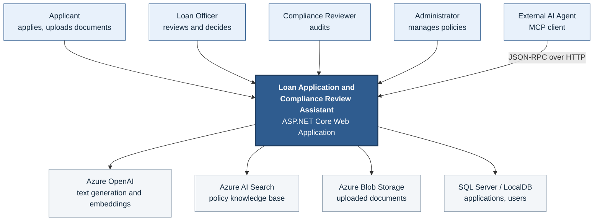

**Figure 5.1 — System context diagram.**

**Reading the diagram.** All four human roles reach the system through a web browser. An external AI
agent can also connect, but only through the MCP endpoint and only to a fixed set of tools. The system
depends on four external services: two AI services from Azure, one for file storage, and one
relational database. Nothing else is called.

## 6. System Architecture

This is the layered view: the request path from the user's browser down to the domain core, and the
infrastructure services that sit alongside it.

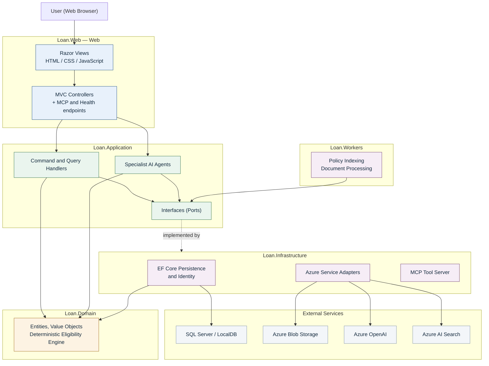

**Figure 6.1 — High-level layered architecture.**

**Reading the diagram.** A browser request arrives at a controller. The controller does no business
work of its own; it calls a handler or an agent in the Application layer. Those, in turn, use the
Domain layer for rules and calculations, and talk to the outside world only through interfaces. The
Infrastructure layer supplies the concrete implementations of those interfaces and owns every
connection to an external service. The dotted arrow marks this inversion: the Application layer
declares what it needs, and Infrastructure plugs itself in.

The Background layer is a separate runnable program (`Loan.Workers`) that shares the same Application
and Infrastructure code. Its main job today is to synchronise the policy knowledge base at startup.

## 7. Clean Architecture and Dependency Direction

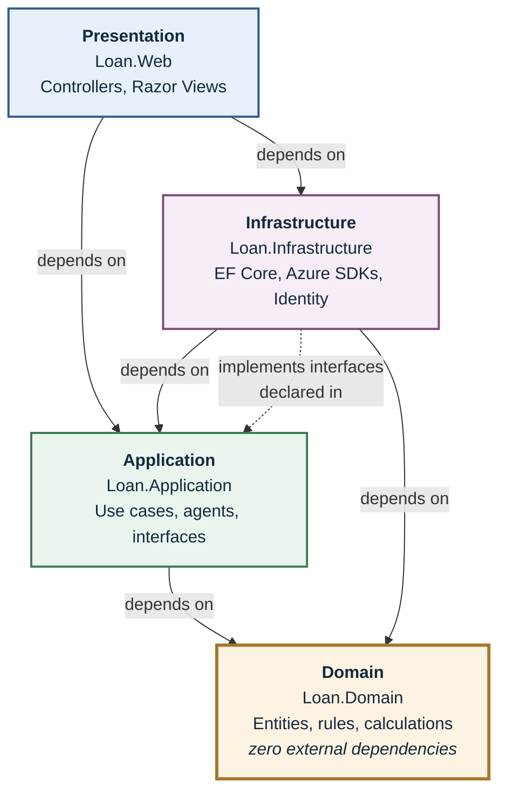

**Figure 7.1 — Clean Architecture dependency direction.**

### Explained simply

Think of the system as four rings, with the business rules in the middle.

The **Domain** layer in the centre holds what a loan application *is* and what the lending rules *say*.
It is written in plain C# with no references to any database, any cloud service, or any web framework
at all. Its project file lists **zero external packages** — this is verifiable, not aspirational. That
matters because it means the rules can be tested instantly and cannot be quietly broken by a change to
a library or a cloud SDK.

The **Application** layer sits just outside. It orchestrates the steps of each use case: evaluate this
application's eligibility, upload and extract this document, prepare this recommendation. When it
needs something from the outside world — a language model, a policy search, a place to save data — it
does not reach for a specific product. It declares an interface describing what it needs, such as
`IChatModel` or `IPolicyRetriever`, and calls that.

The **Infrastructure** layer supplies the real implementations. `AzureOpenAIChatModel` satisfies
`IChatModel`; `AzureAiSearchPolicyRetriever` satisfies `IPolicyRetriever`. Note the arrow direction:
Infrastructure depends on Application, not the other way round. This is the key idea, and it is why the
inner layers never need to know that Azure exists.

The **Presentation** layer is the website. Controllers translate browser requests into calls on
Application handlers, and turn the results into Razor views.

**Why the direction matters.** Because every arrow points inward, the valuable, rule-bearing code at
the centre has no knowledge of the replaceable technology at the edge. Swapping Azure AI Search for a
different search product would mean writing one new class in Infrastructure. The Domain and
Application layers would not change at all.

## 8. Component Architecture

This diagram names the main working parts inside each layer and shows how they connect.

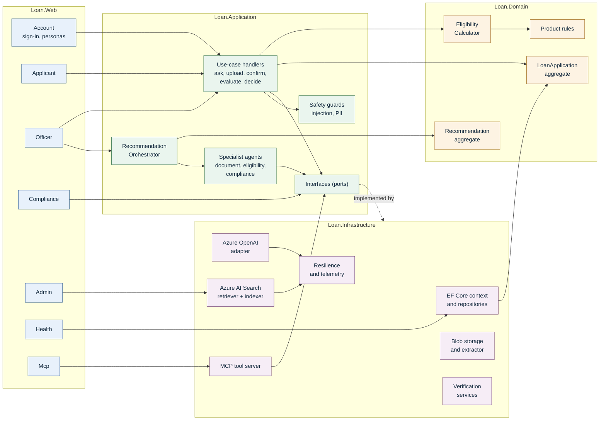

**Figure 8.1 — Component diagram.**

**Reading the diagram.** Each controller owns one persona's screens and delegates all real work
inward. Two components deserve particular attention. The **Recommendation Orchestrator** coordinates
the three specialist agents and then saves a draft; it is the heart of the AI analysis path. The
**MCP Tool Server** offers a parallel, non-browser way in — external agents can read verification data
and save drafts, but cannot reach any decision-making path.

## 9. AI and RAG Architecture

### 9.1 The idea in plain language

If you ask a language model a policy question directly, it will answer from general knowledge and may
invent a rule that this lender does not have. That is unacceptable in a regulated setting.

So the system does something different. Before the model is allowed to answer, the system searches the
lender's own policy documents for passages relevant to the question. Only those passages are handed to
the model, along with an instruction to answer using that text alone and to cite it. This is commonly
called **retrieval-augmented generation**, or RAG. The practical effect is that the answer stays tied
to the lender's actual policies, and the user can check it, because every claim names the document,
version and section it came from.

### 9.2 Answering a question

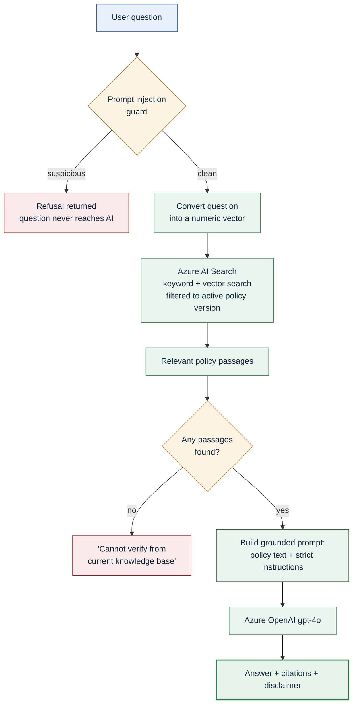

**Figure 9.1 — Retrieval-augmented answering flow.**

**Reading the diagram.** Three safety properties are visible here. First, a suspicious question is
refused *before* any AI or search call is made. Second, if the search finds nothing relevant, the
system says so rather than letting the model improvise — there is no silent fall back to invented
content. Third, every successful answer carries citations and an informational disclaimer.

**Hybrid search, briefly.** The search runs two ways at once. Keyword search catches exact terms such
as "TRID" or "43%". Vector search catches meaning, so a question about "how much I can borrow" still
finds a passage titled "maximum loan amount". Combining both gives better results than either alone.

### 9.3 Where the AI features appear

| Feature | Who uses it | What grounds the answer |
|---|---|---|
| Product and policy assistant | Applicant | Retrieved policy passages |
| Underwriting assistant | Loan Officer | Retrieved policy passages |
| Compliance assistant | Compliance Reviewer | Retrieved policy passages |
| Document field extraction | System, on upload | The uploaded document's own text |
| Recommendation narrative | System, for the officer | Deterministic indicators + retrieved policy |

All three chat assistants stream their answers to the browser token by token, so the user sees the
response forming rather than waiting for a blank screen.

## 10. Policy Indexing Architecture

Before anything can be retrieved, the policy documents have to be prepared and loaded into the search
index. This is the other half of RAG.

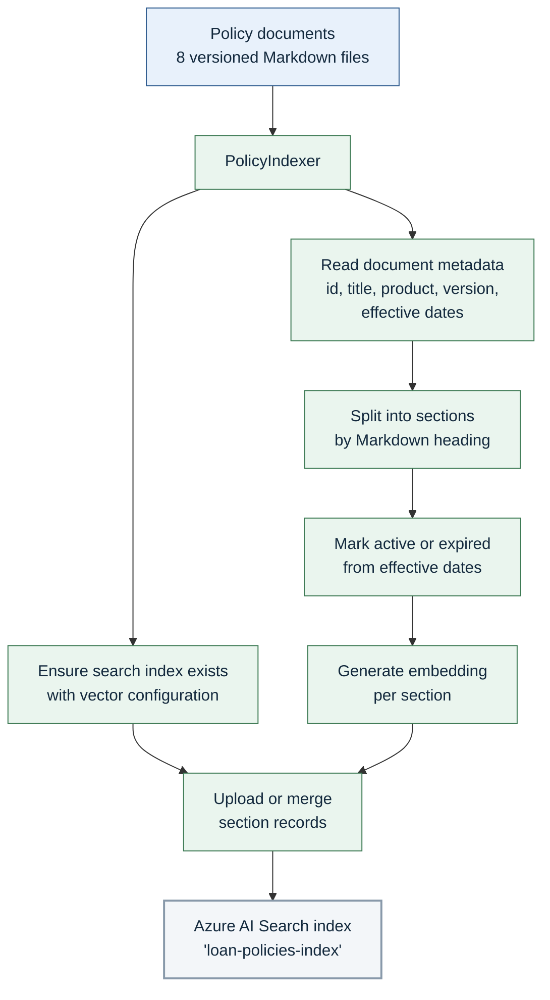

**Figure 10.1 — Policy indexing flow.**

**Reading the diagram.** A policy document is not indexed as one block. It is split at its headings
into sections, and each section becomes its own searchable record. That is what makes precise citation
possible: a retrieved result points at "Section 3.1 of the Residential Mortgage Underwriting Guide
v1.2", not at a whole document.

**Why versioning matters here.** Each document declares a version and an effective date range, and the
indexer marks whether it is currently active. The knowledge base deliberately contains both an expired
and a current version of the same product guide, so the system can demonstrate that retrieval returns
the rule in force today rather than a superseded one.

**When indexing runs.** Three ways: automatically when the `Loan.Workers` background program starts;
on demand when an Administrator presses the synchronise button; and when an Administrator uploads a new
policy document.

## 11. Document Processing Architecture

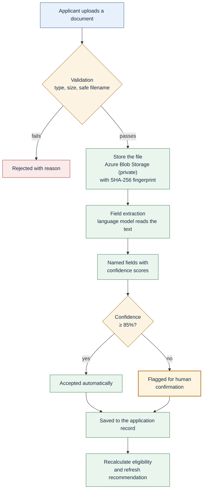

**Figure 11.1 — Document processing flow.**

**Reading the diagram.** Two design points stand out.

**The confidence gate.** A field the model was confident about is accepted; a field it was unsure about
is marked as needing confirmation and shown to the applicant or officer for review. The system does not
pretend to certainty it does not have. Until a low-confidence field is confirmed by a person, the
application is held back from officer review.

**The document fingerprint.** Every stored file is hashed with SHA-256 as it is written. The hash is
kept with the document record, so it can later be shown that the stored file is the one that was
uploaded.

**Extraction is text-based.** The extractor reads the uploaded file as text and asks the language model
to identify the fields. This works for text-based documents. Image scans and PDFs are stored safely but
do not yield text, so they fall through to a synthetic extractor that returns demonstration values. No
OCR service is integrated in the current implementation. This is recorded in the companion
observations document.

## 12. Loan Application Workflow

### 12.1 End-to-end flow

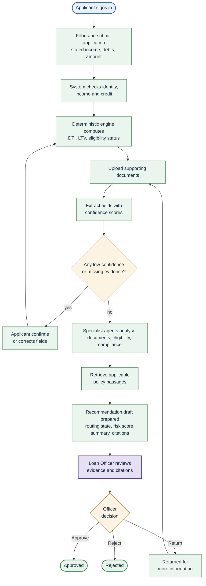

**Figure 12.1 — Loan application workflow.**

**Reading the diagram.** Notice the two loops. The first sends the application back for field
confirmation whenever evidence is weak or missing, and re-runs the deterministic calculation afterwards.
The second is the officer's option to return an application for more information. Neither loop can be
short-circuited by the AI.

Also notice where the human icon sits: the officer review step is the only route to a final state. The
AI path ends at "recommendation draft prepared".

### 12.2 Application lifecycle states

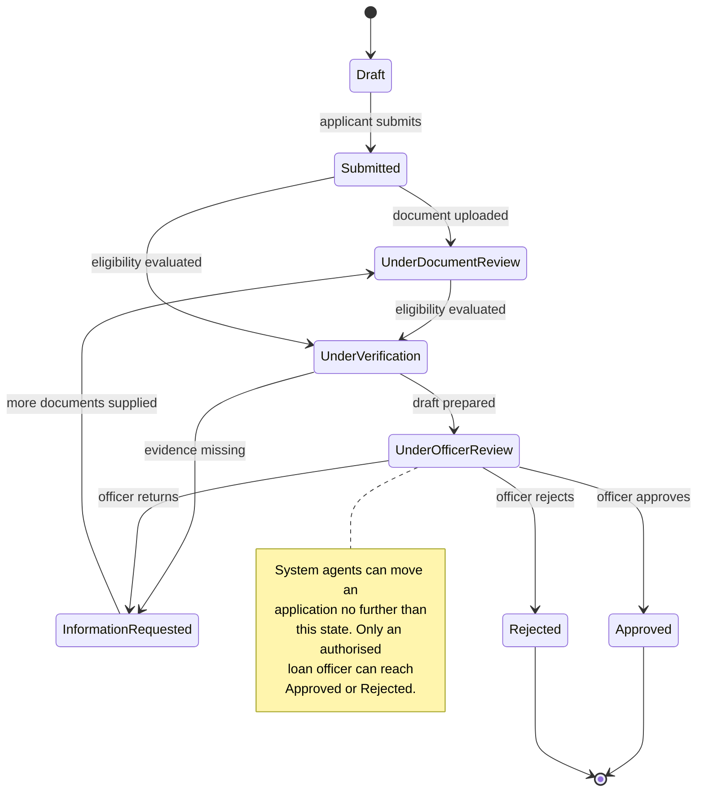

**Figure 12.2 — Application lifecycle state machine.**

## 13. AI Safety and Human-in-the-Loop

### 13.1 The division of responsibility

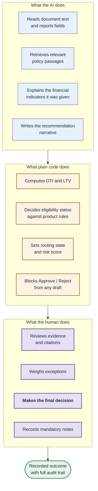

**Figure 13.1 — Human-in-the-loop division of responsibility.**

**Reading the diagram.** The three zones are strictly ordered. AI output feeds deterministic code, and
deterministic code feeds the human. There is no arrow from the AI zone straight to the outcome.

### 13.2 How the boundary is enforced

This is enforced by code, not by convention. Five mechanisms:

| Mechanism | What it does |
|---|---|
| **Deterministic calculation** | All ratio and threshold arithmetic runs in the domain layer's eligibility engine. The AI is handed the results as fixed inputs. |
| **Deterministic override** | After the specialist agents run, the orchestrator discards any routing state or risk score the model might imply and recomputes both from the domain indicators alone. |
| **Draft-only write path** | The handler that saves recommendations rejects `Approve`, `Approved`, `Reject` and `Rejected` as routing states. Permitted values are only `PendingInformation`, `ManualReview` and `ReadyForOfficerReview`. |
| **Officer-exclusive decisions** | A separate handler, reachable only from an authenticated officer or administrator, is the sole route to a final status. Decision notes are mandatory. |
| **Bounded agent prompts** | Each specialist agent's system prompt explicitly forbids it from performing arithmetic, overriding domain status, or issuing approvals. |

### 13.3 Protection against manipulation

Because an attacker might try to talk the AI into misbehaving, inputs are screened before they reach
retrieval or the model. A guard checks incoming questions for known manipulation patterns — attempts to
override instructions, to reveal the system prompt, to bypass verification, or to force an approval.
A flagged question receives a refusal and never reaches the AI. The same guard runs on all three chat
assistants. A deliberately adversarial sample document is kept in the repository so this behaviour can
be demonstrated, and five adversarial prompts are part of the standing evaluation suite.

## 14. Security Architecture

### 14.1 Authentication and authorisation flow

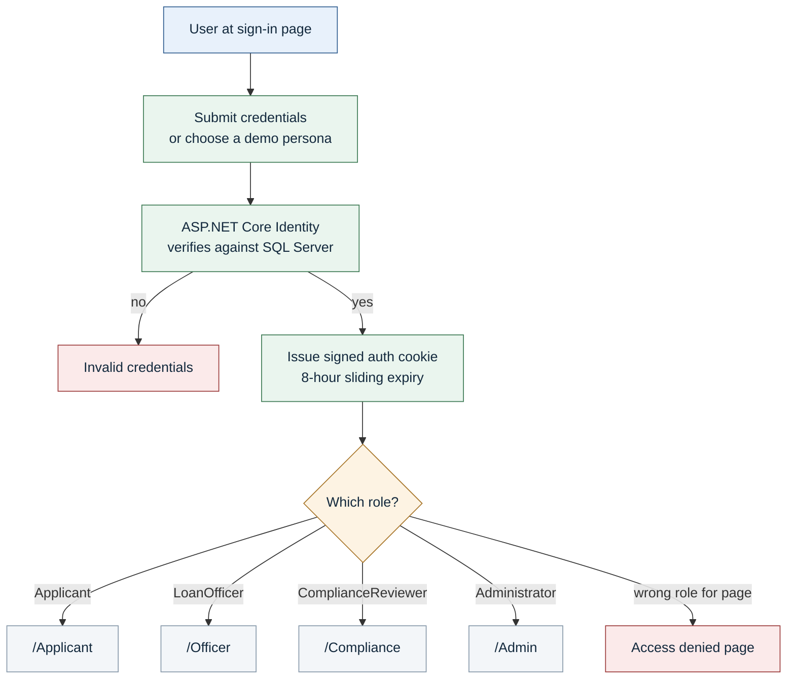

**Figure 14.1 — Authentication and authorisation flow.**

### 14.2 Implemented security mechanisms

| Area | What is implemented |
|---|---|
| **Authentication** | ASP.NET Core Identity with cookie authentication. Passwords are hashed by Identity. The cookie is HTTP-only with an 8-hour sliding expiry. |
| **Authorisation** | Role checks declared on each controller. Applicant and Officer dashboards are mutually inaccessible; Administrator has access to all. |
| **Roles** | Four seeded roles: `Applicant`, `LoanOfficer`, `ComplianceReviewer`, `Administrator`. |
| **Separation of duties** | The Compliance Reviewer role is refused permission to confirm or override extracted facts — compliance audits the record without editing it. |
| **Record isolation** | An applicant may only act on the application linked to their own account; a mismatch returns "forbidden". The MCP tool server independently verifies that a requested synthetic identity actually belongs to the named application. |
| **Decision authorisation** | Officer decisions are re-checked inside the action, in addition to the controller-level role check. |
| **Secrets handling** | Endpoints and keys are supplied through .NET User Secrets or environment variables. The tracked configuration files contain only placeholders — no live key, connection string or password is committed. |
| **Upload safety** | Uploads are limited to a permitted extension list with a 10 MB cap; executable and script types are explicitly blocked; filenames are sanitised and path-traversal attempts rejected. |
| **Personal data** | Sensitive field values such as national insurance or account numbers are masked for display; a masking helper redacts identifiers, account numbers and email addresses from text. |
| **Prompt injection defence** | Manipulation attempts are intercepted before retrieval or model calls, on every chat assistant. |
| **Cross-site request forgery** | Sign-in, persona sign-in and sign-out actions validate an anti-forgery token. |
| **Transport security** | HTTPS redirection is enabled; HSTS is applied outside development. |
| **Audit information** | Field confirmations and overrides record actor, role, action, reason, correlation identifier and timestamp. Recommendation and officer actions record action, actor, timestamp and notes. |

### 14.3 Known security observations

Two items are recorded here for completeness and detailed in the companion observations document:

- The MCP endpoint is **not** protected by an authorisation attribute. Its internal scope checks and
  its refusal to accept final decisions still apply, but the endpoint itself accepts anonymous
  requests, and in development it honours actor headers supplied by the caller.
- Demo persona passwords are present in source code to support one-click demonstration sign-in. This is
  appropriate for a synthetic evaluation build and would not be for production.

## 15. Data Architecture

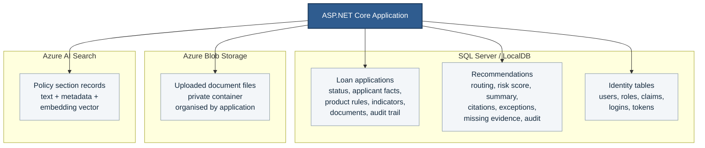

**Figure 15.1 — Data architecture.**

### What each store holds

| Store | Contents | Why here |
|---|---|---|
| **SQL Server / LocalDB** | Loan applications and their status; recommendations with citations and audit trails; all Identity data for users and roles. | Structured business records needing transactional consistency and queryability. |
| **Azure Blob Storage** | The uploaded document files themselves, in a private container, grouped by application, each with its SHA-256 fingerprint recorded. | Files do not belong in a relational database. A private container keeps them out of public reach. |
| **Azure AI Search** | One record per policy section: its text, its metadata (document, product, version, effective dates, active flag) and its embedding vector. | Purpose-built for combined keyword and meaning-based retrieval. |

**A note on how records are shaped.** The relational schema is deliberately compact — two business
tables plus the standard Identity tables. Rich nested structures such as the list of documents on an
application, the extracted fields within each document, the citations on a recommendation and the audit
entries are stored as JSON inside columns rather than as separate normalised tables. This keeps each
aggregate loading and saving as a single unit, which suits the way the domain layer works. The
trade-off is that these nested values cannot be queried directly with SQL. The Low-Level Design
document covers the exact columns.

## 16. External Services

| Service | Purpose | How it is integrated | Behaviour when unavailable |
|---|---|---|---|
| **Azure OpenAI** | Generates text for chat answers, document field extraction and recommendation narratives. Also produces the embedding vectors used for meaning-based search. | `Azure.AI.OpenAI` SDK. Chat model `gpt-4o`; embedding model `text-embedding-3-small`. Reached through the `IChatModel` interface. | Returns a clearly-worded degraded-service message directing the user to manual review. Retries with backoff first. |
| **Azure AI Search** | Stores and retrieves the policy knowledge base. Runs hybrid keyword plus vector search with metadata filters. | `Azure.Search.Documents` SDK. Index `loan-policies-index`, vector dimension 1536, HNSW with cosine similarity. Reached through `IPolicyRetriever`. | Returns an empty result set. The assistant then states it cannot verify the answer — it does not invent one. |
| **Azure Blob Storage** | Holds uploaded applicant documents in a private container. | `Azure.Storage.Blobs` SDK. Container `loan-documents`. Reached through `IDocumentStorageService`. | Falls back automatically to local file storage under the application's data folder. |
| **SQL Server / LocalDB** | Stores loan applications, recommendations, and all Identity data. | Entity Framework Core 8 with the SQL Server provider. Migrations applied automatically in development. | The readiness health check reports unhealthy; the application cannot function without it. |
| **Model Context Protocol server** | Exposes typed verification and policy tools to external AI agents. This is provided *by* the system rather than consumed. | Custom JSON-RPC 2.0 implementation at `POST /api/mcp`. | Not applicable — hosted in-process. |

**Also present in the codebase:** Microsoft Semantic Kernel is referenced and configured with four
tool plugins. It is exercised by tests but is **not invoked on any live request path** in the current
implementation. It is listed here for completeness and flagged in the observations document, so no
reader mistakes it for an active component.

## 17. Deployment Architecture

### 17.1 Current state — local development

The repository supports local execution only. There is no infrastructure-as-code, no container
definition and no continuous integration or deployment pipeline. The diagram below is therefore the
*actual* deployment topology, not an aspiration.

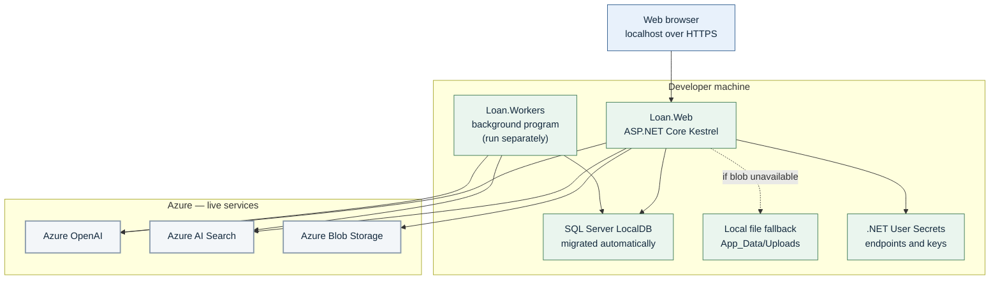

**Figure 17.1 — Current deployment architecture (local development).**

### 17.2 What runs where

| Component | Where it runs today | Notes |
|---|---|---|
| Web application | Locally on Kestrel | The main application; hosts the UI, MCP endpoint and health endpoints. |
| Background workers | Locally, as a separate program | Must be started independently. Not required for the web application to work. |
| Database | SQL Server LocalDB on the machine | Migrations and demo data are applied automatically on development startup. |
| Document storage | Azure Blob Storage when configured, otherwise a local folder | The fallback is automatic and logged. |
| AI and search services | **Genuinely in Azure** | These are live cloud calls, configured through User Secrets. |

**To be precise about what is and is not deployed:** the *application* is local; the *AI and search
services it calls* are real Azure resources. Anyone presenting this system should describe it as a
locally-hosted application integrated with live Azure services — not as a cloud-deployed solution.

## 18. Observability and Logging

| Capability | Implementation |
|---|---|
| **Logging** | The standard .NET logging framework, injected where needed. Infrastructure adapters log service initialisation, fallback decisions, indexing progress, search queries and failures. |
| **Correlation identifiers** | Middleware assigns a correlation identifier to every request, returns it in the `X-Correlation-ID` response header, and makes it available to the telemetry collector. A caller-supplied identifier is honoured. |
| **Telemetry** | An in-memory collector records, per request: prompt and completion token counts, model latency, retrieval latency and hit count, per-agent stage latency, tool call count, error category, routing distribution and officer decision. The most recent 100 requests are retained. |
| **Liveness check** | `GET /health` — immediate, makes no external calls. |
| **Readiness check** | `GET /health/ready` — tests the database connection with a 3-second timeout. |
| **Dependency detail** | `GET /health/details` — reports database, Azure OpenAI and Azure AI Search status. An AI service being unconfigured yields "Degraded" rather than "Unhealthy", because the application still functions without it. |
| **Telemetry inspection** | `GET /health/telemetry` — returns recent telemetry records. Restricted to development unless explicitly enabled. |
| **Error handling** | Outside development, unhandled errors route to an error page and HSTS applies. External service failures are caught at the adapter boundary and converted into safe degraded responses rather than propagating. |
| **Resilience** | A retry policy with exponential backoff and jitter, a 10-second per-call timeout, and a circuit breaker that opens after five consecutive failures. Caller cancellation is never retried. |

**Observation.** Telemetry is held in process memory. It is not exported to Application Insights or any
other external monitoring system, and it is lost on restart. The Administrator dashboard's service
status tiles are presentation text rather than live probes; the genuine probe results are at
`/health/details`.

## 19. Architecture Decisions

| # | Decision | Rationale |
|---|---|---|
| AD-1 | **Clean Architecture with a dependency-free domain** | Keeps lending rules independent of any framework or cloud SDK, so they are fast to test and cannot be broken by an infrastructure change. The domain project genuinely references no external packages. |
| AD-2 | **Deterministic financial calculation, never AI arithmetic** | Language models are unreliable at arithmetic and not reproducible. Ratio and threshold logic is ordinary C# so results are identical every time and can be unit-tested exactly at their boundaries. |
| AD-3 | **Human-in-the-loop for all consequential decisions** | Lending decisions have legal consequences. The system prepares drafts; a person decides. Enforced by rejecting final decisions on the draft path. |
| AD-4 | **Retrieval-augmented generation for all policy answers** | Prevents invented rules. The model may only speak about policy text actually retrieved, and must cite it. |
| AD-5 | **Hybrid keyword plus vector search** | Keyword search handles exact terms and figures; vector search handles paraphrased questions. Together they retrieve better than either alone. |
| AD-6 | **Section-level chunking of policy documents** | Splitting at headings makes citations precise enough to be checked — document, version and section. |
| AD-7 | **Version-aware policy retrieval** | Policies expire. Metadata filters restrict retrieval to the version in force, avoiding compliance error. |
| AD-8 | **Confidence threshold on extracted fields** | Below 85% confidence a field must be confirmed by a person, and the application is held from officer review. Machine uncertainty becomes an explicit human checkpoint. |
| AD-9 | **Verified facts take precedence over stated facts** | An applicant's claim cannot override a verified value. The domain resolves the effective value by precedence. |
| AD-10 | **Entity Framework Core with aggregate JSON columns** | Each aggregate loads and saves as one unit, matching the domain model, at the cost of direct SQL queryability on nested data. |
| AD-11 | **ASP.NET Core Identity for authentication** | A mature, built-in framework covering password hashing, roles, claims and cookies. No need to build any of it. |
| AD-12 | **Azure Blob Storage with automatic local fallback** | Documents belong in object storage, but the system must still run for demonstration without cloud storage configured. |
| AD-13 | **Interfaces for every external dependency** | Every external service is reached through an Application-layer interface, so it can be substituted in tests and replaced without touching business logic. |
| AD-14 | **Model Context Protocol for external agent access** | An open standard for exposing tools to AI agents, with a deliberately narrow surface: read-only verification plus a draft-only write. |
| AD-15 | **Synthetic verification services and synthetic data** | Keeps a capstone system free of real personal data and real bureau dependencies while exercising the same interfaces a real integration would. |
| AD-16 | **Server-sent events for streaming responses** | Lets answers appear progressively using a simple built-in web mechanism, without adding a real-time framework. |
| AD-17 | **Safe degradation over hard failure** | An unavailable AI service yields a clear degraded message; an unavailable search yields an honest "cannot verify". The system never invents content to cover a failure. |

## 20. HLD Summary

### How the pieces fit together

An **applicant** signs in and creates an application, entering their income, debts and the amount they
want to borrow. The system immediately checks identity, income and credit through typed verification
services, then computes the debt-to-income and loan-to-value ratios and an eligibility status using
**plain C# code in the domain layer**. Those numbers are the system's single source of financial truth.

The applicant uploads supporting documents. Each file is validated, stored in a private container with
a cryptographic fingerprint, and read by a **language model** that reports the fields it found along
with how confident it was. Fields it was confident about are accepted; the rest are flagged, and the
application cannot proceed to officer review until a person confirms them.

When a **loan officer** opens the application, three **specialist agents** run. One assesses document
completeness and confidence. One explains the financial indicators — using the deterministic numbers it
was given, never recalculating them. One retrieves the applicable policy text from **Azure AI Search**,
filtered to the product and the version currently in force, and reports exceptions with citations. An
**orchestrator** then combines their findings, discards any AI-implied routing in favour of values
derived purely from the domain calculation, has the model write a plain-English summary, and saves the
result as a **draft**.

The officer reads that draft with its citations, evidence gaps and ratios, can ask the underwriting
assistant follow-up questions grounded in the same policy corpus, and then records the decision with
mandatory notes. **Only that officer action can approve or reject the loan.** A **compliance reviewer**
can audit the whole trail afterwards but cannot alter the facts. An **administrator** maintains the
policy knowledge base and watches system health.

### The single most important property

Every consequential decision belongs to a person, and the system is built so the AI cannot take one
even if instructed to. The arithmetic is deterministic; the routing is deterministic; the draft path
refuses final decisions outright; and every AI answer is tied to a citation the reader can check. The
AI removes the mechanical effort. The judgement, and the accountability, stay human.

## 21. Potential Future Improvements

These are **not implemented**. They are recorded separately so that nothing here is mistaken for a
current capability.

| Area | Possible improvement |
|---|---|
| **Document intelligence** | Add a genuine OCR service so scanned images and PDFs yield extractable text, rather than falling back to synthetic values. |
| **Cloud deployment** | Add infrastructure-as-code, a container definition and a CI/CD pipeline; host the web application on a managed Azure service. |
| **Identity for Azure services** | Replace API keys with managed identity and role-based access, removing long-lived secrets. |
| **Monitoring** | Export telemetry to Application Insights or OpenTelemetry so metrics survive restarts and support alerting. |
| **Background processing** | Complete the document processing worker into a real queue consumer so extraction can run asynchronously at volume. |
| **Data model** | Normalise documents, extracted fields and audit entries into their own tables to make them directly queryable and reportable. |
| **MCP hardening** | Require authentication on the MCP endpoint and remove header-based actor identity outside development. |
| **Real verification integrations** | Replace synthetic identity, income and credit services with real bureau integrations behind the existing interfaces. |
| **Semantic Kernel** | Either bring the configured Semantic Kernel agent onto a live path with function calling, or remove it to avoid ambiguity. |
| **Admin dashboard** | Replace the presentational status tiles with live values from the dependency health endpoint. |

---

**End of High-Level Design Document** · Loan Application and Compliance Review Assistant · Version 1.0 · 22 September 2026

*Companion documents: `LLD-Loan-Application-and-Compliance-Review-Assistant.md` · `Implementation-Observations-and-Discrepancies.md`*

