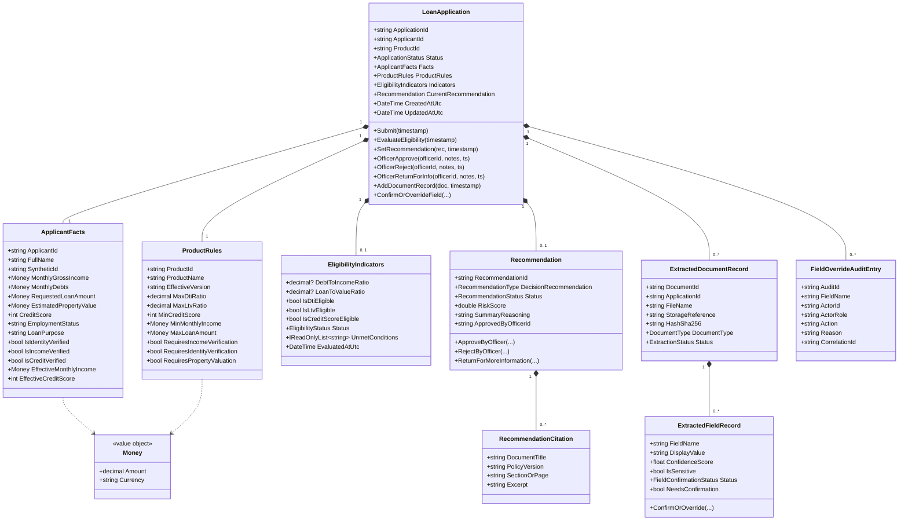
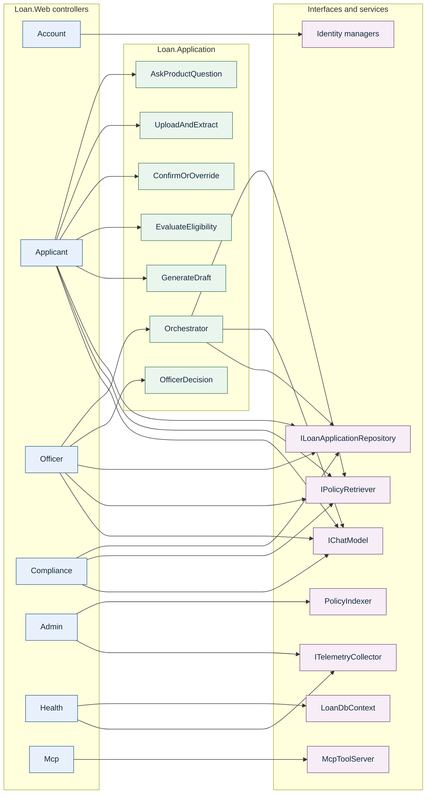
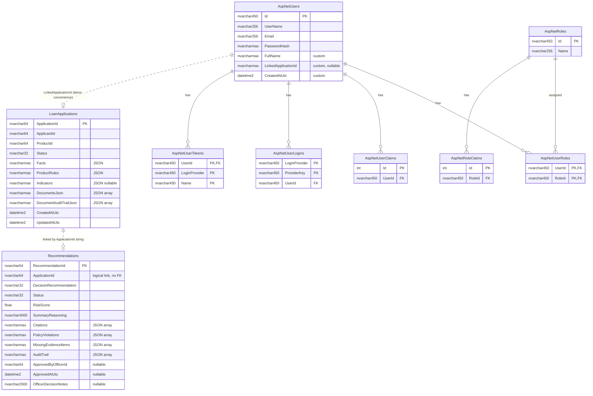
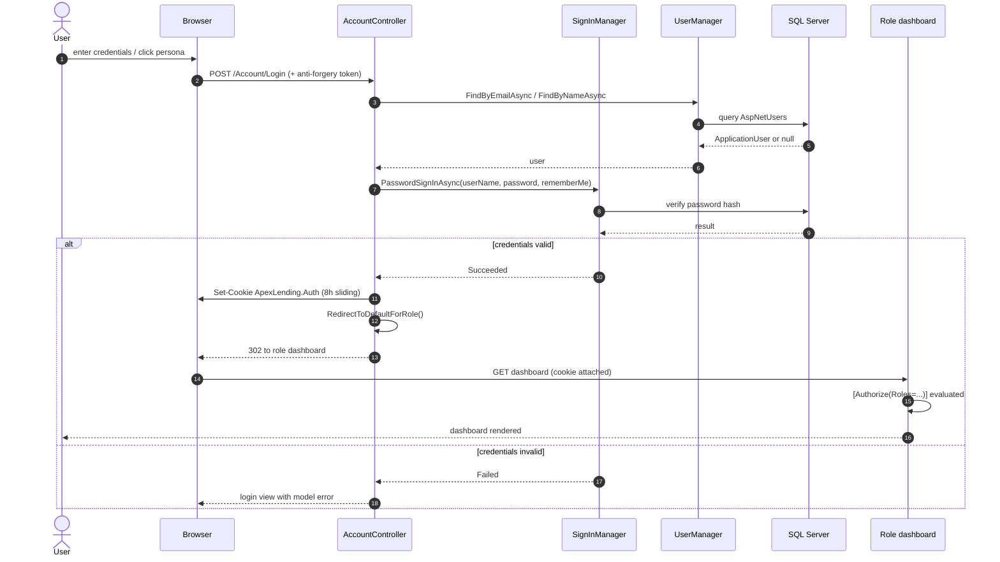
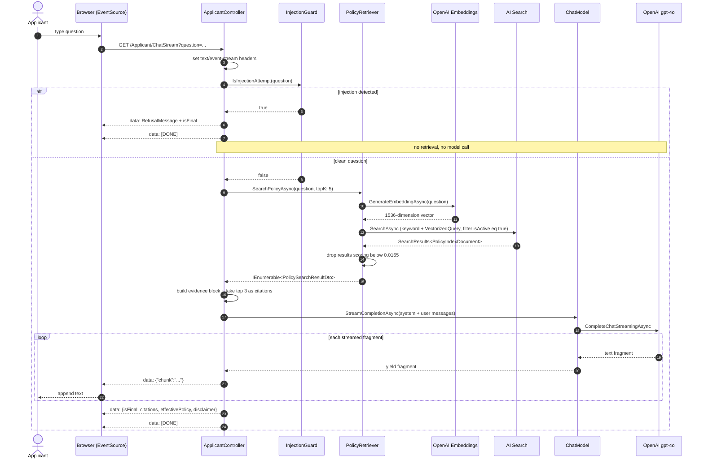
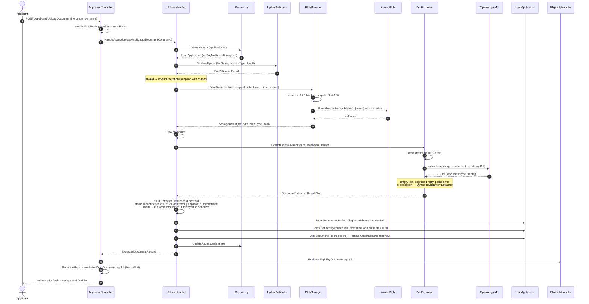
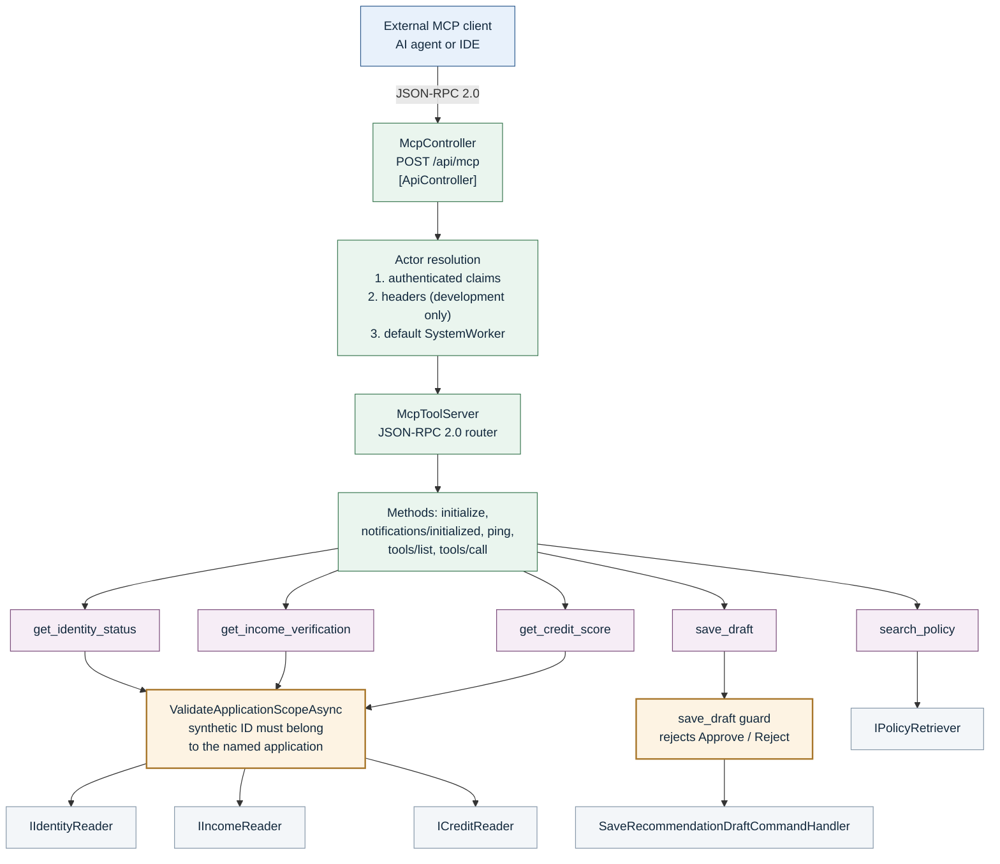
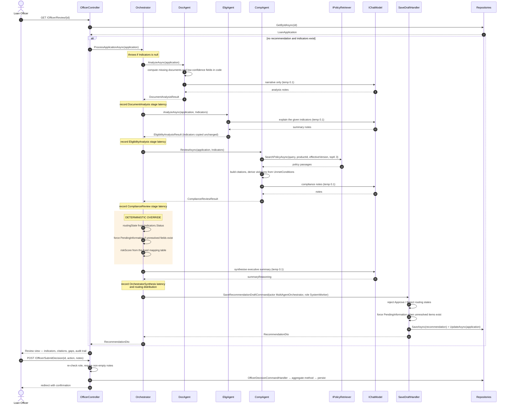

# Loan Application and Compliance Review Assistant

## Low-Level Design Document

<div class="cover-meta">

| Field | Value |
|---|---|
| **Project Name** | Loan Application and Compliance Review Assistant |
| **Document Type** | Low-Level Design (LLD) |
| **Version** | 1.0 |
| **Date** | 22 September 2026 |
| **Solution File** | `LoanAssistant.slnx` |
| **Target Framework** | `net8.0` |
| **Language Features** | Nullable reference types enabled, implicit usings enabled |
| **Source Projects** | 5 (`Loan.Domain`, `Loan.Application`, `Loan.Infrastructure`, `Loan.Web`, `Loan.Workers`) |
| **Test Projects** | 6 (161 tests, all passing) |
| **EF Core Migrations** | 3 (`InitialCreate`, `AddDocumentExtraction`, `AddIdentityTables`) |
| **Business Tables** | 2 (`LoanApplications`, `Recommendations`) + ASP.NET Identity tables |
| **MCP Tools** | 5 |
| **Build Verification** | `dotnet build` — succeeded, 0 errors, 0 warnings |
| **Test Verification** | All 6 suites executed; 161 passed, 0 failed, 0 skipped |
| **Basis of Document** | Source code, EF Core model and migrations, configuration keys, tests |

</div>

> **Source-of-truth note.** Every class name, method name, interface, table, column, endpoint,
> configuration key and tool name in this document was read from the repository source. Components that
> exist but are not reached on any live request path are marked as such. Defects and documentation
> mismatches found while writing this document are **not** corrected here — they are recorded in
> `Implementation-Observations-and-Discrepancies.md`. No application code was modified.

<div class="page-break"></div>

## Table of Contents

1. [System Structure](#1-system-structure)
2. [Project Responsibilities](#2-project-responsibilities)
3. [Domain Layer](#3-domain-layer)
4. [Application Layer](#4-application-layer)
5. [Infrastructure Layer](#5-infrastructure-layer)
6. [Web Layer](#6-web-layer)
7. [Database Design](#7-database-design)
8. [Authentication and Authorisation](#8-authentication-and-authorisation)
9. [AI Assistant Internal Flow](#9-ai-assistant-internal-flow)
10. [RAG Implementation](#10-rag-implementation)
11. [Policy Indexing](#11-policy-indexing)
12. [Document Processing](#12-document-processing)
13. [MCP Server and Tools](#13-mcp-server-and-tools)
14. [Recommendation and Compliance Flow](#14-recommendation-and-compliance-flow)
15. [Controller and Endpoint Reference](#15-controller-and-endpoint-reference)
16. [Configuration](#16-configuration)
17. [Error Handling, Resilience and Logging](#17-error-handling-resilience-and-logging)
18. [Testing Architecture](#18-testing-architecture)
19. [Security Considerations](#19-security-considerations)
20. [Performance Considerations](#20-performance-considerations)
21. [LLD Summary](#21-lld-summary)

<div class="page-break"></div>

## 1. System Structure

Actual directory layout of the repository, as verified on disk.

```text
LoanAssistant/
├── LoanAssistant.slnx
├── README.md
├── context_UPDATED.md
├── CLAUDE_IMPLEMENTATION_PROMPT_UPDATED.md
├── implementation_plan.md
├── decision-log.md
├── change-log.md
├── task-checklist.md
├── docs/
│
├── src/
│   ├── Loan.Domain/                        ← no external package references
│   │   ├── Applications/
│   │   │   ├── LoanApplication.cs           (aggregate root, ApplicationStatus enum)
│   │   │   ├── ApplicantFacts.cs
│   │   │   └── ExtractedField.cs            (generic type; not used on live paths)
│   │   ├── Common/
│   │   │   ├── Money.cs                     (readonly record struct)
│   │   │   └── DomainExceptions.cs
│   │   ├── Documents/
│   │   │   ├── ExtractedDocumentRecord.cs   (DocumentType, ExtractionStatus enums)
│   │   │   ├── ExtractedFieldRecord.cs      (FieldConfirmationStatus enum)
│   │   │   └── FieldOverrideAuditEntry.cs
│   │   ├── Eligibility/
│   │   │   ├── EligibilityCalculator.cs     (static domain service)
│   │   │   └── EligibilityIndicators.cs     (EligibilityStatus enum)
│   │   ├── Products/
│   │   │   └── ProductRules.cs              (3 named factory methods)
│   │   └── Recommendations/
│   │       └── Recommendation.cs            (RecommendationType, RecommendationStatus)
│   │
│   ├── Loan.Application/                   ← references Loan.Domain only
│   │   ├── Abstractions/
│   │   │   ├── IChatModel.cs
│   │   │   ├── IDocumentExtractor.cs
│   │   │   ├── IDocumentStorageService.cs
│   │   │   ├── IPolicyRetriever.cs
│   │   │   ├── IRepositories.cs
│   │   │   ├── ITelemetryCollector.cs
│   │   │   └── IVerificationServices.cs
│   │   ├── Agents/
│   │   │   ├── AgentModels.cs
│   │   │   ├── AgentPrompts.cs
│   │   │   ├── DocumentAnalysisAgent.cs
│   │   │   ├── EligibilityAnalysisAgent.cs
│   │   │   ├── ComplianceReviewAgent.cs
│   │   │   └── RecommendationOrchestratorAgent.cs
│   │   ├── Common/
│   │   │   ├── CorrelationContext.cs
│   │   │   ├── PiiMasker.cs
│   │   │   └── PromptInjectionGuard.cs
│   │   ├── DTOs/
│   │   ├── Documents/
│   │   │   ├── UploadAndExtractDocumentCommand.cs
│   │   │   ├── ConfirmOrOverrideExtractedFieldsCommand.cs
│   │   │   └── DocumentUploadValidator.cs
│   │   ├── ProductAdvice/AskProductQuestionQuery.cs
│   │   ├── Recommendations/
│   │   │   ├── RecommendationCommands.cs
│   │   │   └── SaveRecommendationDraftCommand.cs
│   │   └── Verification/EvaluateEligibilityCommand.cs
│   │
│   ├── Loan.Infrastructure/                ← Azure SDKs, EF Core, Semantic Kernel
│   │   ├── DependencyInjection.cs
│   │   ├── AzureOpenAI/
│   │   │   ├── AzureOpenAIChatModel.cs
│   │   │   └── SyntheticChatModel.cs        (test use only; not DI-registered)
│   │   ├── Documents/
│   │   │   ├── AzureBlobDocumentStorageService.cs
│   │   │   ├── LocalFileDocumentStorageService.cs
│   │   │   ├── AzureOpenAiDocumentExtractor.cs
│   │   │   └── SyntheticDocumentExtractor.cs
│   │   ├── MCP/
│   │   │   ├── McpToolServer.cs
│   │   │   └── McpModels.cs
│   │   ├── Migrations/                      (3 migrations + model snapshot)
│   │   ├── Persistence/
│   │   │   ├── DbContext/
│   │   │   │   ├── LoanDbContext.cs
│   │   │   │   ├── ApplicationUser.cs
│   │   │   │   └── DesignTimeLoanDbContextFactory.cs
│   │   │   ├── Repositories/SqlRepositories.cs
│   │   │   ├── InMemoryRepositories.cs      (test use only)
│   │   │   └── DemoDataSeeder.cs
│   │   ├── Resilience/ResiliencePolicy.cs
│   │   ├── Search/
│   │   │   ├── AzureAiSearchPolicyRetriever.cs
│   │   │   ├── PolicyIndexer.cs
│   │   │   ├── PolicyIndexDocument.cs
│   │   │   ├── SyntheticPolicyRetriever.cs  (test use only; not DI-registered as IPolicyRetriever)
│   │   │   └── SeedPolicies/                (8 versioned .md files + README)
│   │   ├── SemanticKernel/                  (registered but not on any live path)
│   │   │   ├── SemanticKernelAgentService.cs
│   │   │   └── Plugins/LoanAssistantPlugins.cs
│   │   ├── Telemetry/InMemoryTelemetryCollector.cs
│   │   └── Verification/SyntheticVerificationServices.cs
│   │
│   ├── Loan.Web/                           ← ASP.NET Core MVC
│   │   ├── Program.cs
│   │   ├── Controllers/                     (8 controllers)
│   │   ├── Middleware/CorrelationIdMiddleware.cs
│   │   ├── Models/                          (view models per persona)
│   │   ├── Views/                           (Razor views)
│   │   ├── SampleDocuments/                 (6 synthetic text documents)
│   │   ├── wwwroot/                         (fintech-theme.css, site.js, Bootstrap)
│   │   └── appsettings.json                 (placeholders only — no secrets)
│   │
│   └── Loan.Workers/                       ← .NET Worker Service
│       ├── Program.cs
│       ├── Indexing/PolicyIndexingWorker.cs
│       └── Processing/DocumentProcessingWorker.cs
│
└── tests/
    ├── Loan.Domain.Tests/                   (20 tests)
    ├── Loan.Application.Tests/              (59 tests)
    ├── Loan.ContractTests/                  (4 tests)
    ├── Loan.IntegrationTests/               (23 tests)
    ├── Loan.EndToEndTests/                  (34 tests)
    └── Loan.PromptTests/                    (21 tests)
```

<div class="page-break"></div>

## 2. Project Responsibilities

| Project | Responsibility | Important components | References |
|---|---|---|---|
| **Loan.Domain** | Holds the business rules and the vocabulary of lending. Contains no technology concerns at all — no database, no cloud SDK, no web framework. Its project file declares **zero** `PackageReference` entries, which is what makes the Clean Architecture claim verifiable rather than aspirational. | `LoanApplication`, `ApplicantFacts`, `Recommendation`, `ProductRules`, `EligibilityCalculator`, `EligibilityIndicators`, `Money`, `ExtractedDocumentRecord`, `ExtractedFieldRecord`, `FieldOverrideAuditEntry` | *(none)* |
| **Loan.Application** | Orchestrates use cases and declares the interfaces (ports) for everything external. Hosts the AI specialist agents and the safety guards. Knows *what* it needs from the outside world, never *which product* provides it. | `AskProductQuestionQueryHandler`, `EvaluateEligibilityCommandHandler`, `UploadAndExtractDocumentCommandHandler`, `ConfirmOrOverrideExtractedFieldsCommandHandler`, `GenerateRecommendationDraftCommandHandler`, `SaveRecommendationDraftCommandHandler`, `OfficerDecisionCommandHandler`, `RecommendationOrchestratorAgent` + 3 specialist agents, `PromptInjectionGuard`, `PiiMasker`, `DocumentUploadValidator` | Loan.Domain |
| **Loan.Infrastructure** | Implements every Application-layer interface with a real technology. Owns all outbound connections, the EF Core model and migrations, Identity storage, the MCP server and the resilience policy. | `LoanDbContext`, `SqlLoanApplicationRepository`, `SqlRecommendationRepository`, `AzureOpenAIChatModel`, `AzureAiSearchPolicyRetriever`, `PolicyIndexer`, `AzureBlobDocumentStorageService`, `AzureOpenAiDocumentExtractor`, `McpToolServer`, `ResiliencePolicy`, `InMemoryTelemetryCollector`, `DemoDataSeeder`, synthetic verification services | Loan.Application, Loan.Domain |
| **Loan.Web** | The ASP.NET Core MVC presentation layer. Routes requests, enforces role authorisation, renders Razor views, streams AI responses over server-sent events, and hosts the MCP and health endpoints. | 8 controllers, `CorrelationIdMiddleware`, view models, Razor views, `fintech-theme.css`, `site.js` | Loan.Application, Loan.Infrastructure |
| **Loan.Workers** | A separately-runnable .NET Worker Service sharing the same Application and Infrastructure code. Its live function is synchronising the policy index at startup. | `PolicyIndexingWorker` (functional), `DocumentProcessingWorker` (stub — logs and sleeps; no queue consumption) | Loan.Application, Loan.Infrastructure |

<div class="page-break"></div>

## 3. Domain Layer

### 3.1 Domain model relationships



**Figure 3.1 — Domain model class diagram.**

### 3.2 Aggregate root — `LoanApplication`

`LoanApplication` is the aggregate root. All state changes go through its methods, and its collections
are exposed as read-only views (`IReadOnlyList`) over private backing lists, so callers cannot mutate
them directly.

| Method | Behaviour |
|---|---|
| `Submit` | Allowed only from `Draft`, `InformationRequested` or `UnderDocumentReview`; otherwise throws `InvalidApplicationStateException`. |
| `EvaluateEligibility` | Delegates to `EligibilityCalculator.Evaluate`, stores the result and moves status to `UnderVerification`. |
| `SetRecommendation` | Stores the recommendation and moves status to `InformationRequested` if the recommendation type is `PendingInformation`, otherwise `UnderOfficerReview`. |
| `OfficerApprove` / `OfficerReject` / `OfficerReturnForInfo` | Each requires an existing recommendation (otherwise throws), delegates to the corresponding `Recommendation` method, and sets the final status. |
| `AddDocumentRecord` | Rejects a document whose `ApplicationId` does not match; sets status to `UnderDocumentReview`. |
| `ConfirmOrOverrideField` | Locates the document and field, applies the confirmation, appends a `FieldOverrideAuditEntry`, and updates the effective facts when the field is income, debts, credit score or an identity field. |

### 3.3 Value object — `Money`

A `readonly record struct` with `Amount` and `Currency`. It refuses negative amounts, rounds to two
decimal places away from zero, upper-cases the currency, and refuses arithmetic or comparison across
differing currencies. Operators `+`, `-`, `>`, `<`, `>=`, `<=` are defined.

### 3.4 Enumerations

| Enum | Values |
|---|---|
| `ApplicationStatus` | `Draft`, `Submitted`, `UnderDocumentReview`, `UnderVerification`, `UnderOfficerReview`, `Approved`, `Rejected`, `InformationRequested` |
| `EligibilityStatus` | `NotEvaluated`, `PendingInformation`, `Ineligible`, `ReferToHuman`, `Eligible` |
| `RecommendationType` | `PendingInformation`, `Approve`, `ReferToHuman`, `Reject` |
| `RecommendationStatus` | `DraftPreparedBySystem`, `PendingOfficerReview`, `ApprovedByOfficer`, `ReturnedForInfo`, `RejectedByOfficer` |
| `DocumentType` | `Paystub`, `W2`, `BankStatement`, `DriverLicenseOrPassport`, `TaxReturn`, `Generic` |
| `ExtractionStatus` | `Pending`, `Extracted`, `FailedValidation`, `RequiresHumanReview`, `Confirmed` |
| `FieldConfirmationStatus` | `Unconfirmed`, `ConfirmedByApplicant`, `ConfirmedByOfficer`, `Rejected` |

### 3.5 Domain service — `EligibilityCalculator`

A `static` class with one entry point:
`Evaluate(ApplicantFacts facts, ProductRules rules, DateTime evaluationTimestampUtc)` returning
`EligibilityIndicators`. This is the single source of financial truth in the system. Its logic, in
order:

1. **Debt-to-income ratio.** If effective income is zero or negative, the ratio is `null`, DTI is
   ineligible, and an explanatory unmet condition is added — this guards against division by zero.
   Otherwise `DTI = MonthlyDebts / EffectiveMonthlyIncome`, compared against `MaxDtiRatio`.
2. **Loan-to-value ratio.** If the product does not require property valuation (for example a personal
   loan), the ratio is `null` and LTV is treated as eligible — not applicable rather than failed. If
   valuation is required but the property value is zero or negative, the ratio is `null` and LTV is
   ineligible. Otherwise `LTV = RequestedLoanAmount / EstimatedPropertyValue`.
3. **Threshold checks.** Effective credit score against `MinCreditScore`; effective income against
   `MinMonthlyIncome`; requested amount against `MaxLoanAmount`. Identity and income verification
   requirements are checked where the product demands them.
4. **Status precedence**, evaluated in this fixed order:
   `PendingInformation` → `Ineligible` → `ReferToHuman` → `Eligible`.
   Pending verification wins over everything; hard threshold failures yield `Ineligible`; ratio
   breaches alone yield `ReferToHuman`; all clear yields `Eligible`.

Every failure appends a human-readable sentence to `UnmetConditions`, which is what downstream agents
and the officer UI display.

### 3.6 Product definitions

`ProductRules` validates its inputs on construction (DTI between 0 and 1, LTV between 0 and 1.5,
credit score between 300 and 850) and exposes three factory methods:

| Factory | Product ID | Version | Max DTI | Max LTV | Min score | Min income | Max amount | Property valuation |
|---|---|---|---|---|---|---|---|---|
| `CreateStandardMortgage` | `MORTGAGE-STD` | `v1.2` | 43% | 80% | 640 | 3,000 | 750,000 | Required |
| `CreatePersonalLoan` | `LOAN-PERSONAL` | `v2.0` | 38% | 100% | 600 | 2,500 | 75,000 | Not required |
| `CreateAutoLoan` | `LOAN-AUTO` | `v1.1` | 45% | 90% | 620 | 2,000 | 60,000 | Required |

### 3.7 Fact precedence

`ApplicantFacts` exposes two computed properties that implement precedence:

- `EffectiveMonthlyIncome` — returns `VerifiedMonthlyIncome` when income has been verified, otherwise
  the stated `MonthlyGrossIncome`.
- `EffectiveCreditScore` — returns `VerifiedCreditScore` when credit has been verified, otherwise the
  stated `CreditScore`.

Because `EligibilityCalculator` reads only the effective values, a stated figure can never override a
verified one.

### 3.8 Sensitive value masking

`ExtractedFieldRecord.MaskSensitiveValue` recognises a national-identifier pattern
(`ddd-dd-dddd`) and renders it as `***-**-####`; otherwise it masks all but the last four characters.
When a field is marked `IsSensitive`, its `DisplayValue` is masked on confirmation.

<div class="page-break"></div>

## 4. Application Layer

### 4.1 Interfaces (ports)

| Interface | Members | Implemented in Infrastructure by |
|---|---|---|
| `IChatModel` | `GenerateCompletionAsync`, `GenerateStructuredAsync<T>`, `StreamCompletionAsync` | `AzureOpenAIChatModel` (registered); `SyntheticChatModel` (tests only) |
| `IPolicyRetriever` | `SearchPolicyAsync(query, targetProductId, effectiveVersion, topK, ct)` | `AzureAiSearchPolicyRetriever` (registered); `SyntheticPolicyRetriever` (tests only) |
| `IDocumentStorageService` | `SaveDocumentAsync`, `GetDocumentStreamAsync`, `DeleteDocumentAsync` | `AzureBlobDocumentStorageService` (registered, with internal fallback to `LocalFileDocumentStorageService`) |
| `IDocumentExtractor` | `ExtractFieldsAsync(stream, fileName, contentType, ct)` | `AzureOpenAiDocumentExtractor` (registered, falls back to `SyntheticDocumentExtractor`) |
| `ILoanApplicationRepository` | `GetByIdAsync`, `AddAsync`, `UpdateAsync`, `GetByApplicantIdAsync`, `GetPendingOfficerReviewAsync`, `GetAllAsync` | `SqlLoanApplicationRepository` |
| `IRecommendationRepository` | `GetByIdAsync`, `SaveAsync` | `SqlRecommendationRepository` |
| `IIdentityReader` | `VerifyIdentityAsync(syntheticId, ct)` | `SyntheticIdentityService` |
| `IIncomeReader` | `VerifyIncomeAsync(syntheticId, ct)` | `SyntheticIncomeService` |
| `ICreditReader` | `GetCreditScoreAsync(syntheticId, ct)` | `SyntheticCreditService` |
| `ITelemetryCollector` | correlation, token, latency, stage, tool-call, error and decision recording | `InMemoryTelemetryCollector` |

### 4.2 Command and query handlers

The system uses a **hand-rolled command/query handler pattern**, not a CQRS library. There is no
MediatR, no dispatcher and no pipeline behaviour. Each handler is a plain class with a single
`HandleAsync` method, registered in the dependency injection container and injected directly into the
controller that uses it. Commands and queries are C# `record` types.

> **Accuracy note.** Because there is no mediator, no separate read/write model and no event sourcing,
> this is best described as *a command/query handler pattern*, not full CQRS. Earlier project
> documentation calls it "CQRS"; this document uses the more precise description.

| Handler | Input record | Returns | What it does |
|---|---|---|---|
| `AskProductQuestionQueryHandler` | `AskProductQuestionQuery(Question, TargetProductId?, PolicyVersion?)` | `ProductAdviceResponseDto` | Screens for prompt injection, retrieves up to 5 policy passages, builds a strictly-grounded prompt, calls the model, returns answer + citations + version + disclaimer. Returns an explicit "insufficient evidence" answer when retrieval is empty. |
| `EvaluateEligibilityCommandHandler` | `EvaluateEligibilityCommand(ApplicationId)` | `EligibilityIndicatorsDto` | Calls the three verification readers (each wrapped in its own try/catch so one failure marks only that check unverified), then calls `application.EvaluateEligibility` and persists. |
| `UploadAndExtractDocumentCommandHandler` | `UploadAndExtractDocumentCommand(ApplicationId, FileName, ContentType, ContentStream)` | `ExtractedDocumentRecord` | Verifies the application exists, validates the file, stores it, extracts fields, builds domain records with confidence-based status, updates verified facts for high-confidence income and identity documents, attaches the document and saves. |
| `ConfirmOrOverrideExtractedFieldsCommandHandler` | `ConfirmOrOverrideExtractedFieldsCommand(ApplicationId, ActorId, ActorRole, FieldConfirmations, CorrelationId?)` | `void` | Refuses the `ComplianceReviewer` role outright; permits only `Applicant`, `Officer`, `LoanOfficer`; enforces that an applicant may only modify their own application; then applies each confirmation through the aggregate. |
| `GenerateRecommendationDraftCommandHandler` | `GenerateRecommendationDraftCommand(ApplicationId)` | `RecommendationDto` | **Deterministic-only path** (no AI, no retrieval). Collects missing evidence, gates on unconfirmed low-confidence fields and missing mandatory documents, derives a recommendation type, attaches one hardcoded citation, saves. |
| `SaveRecommendationDraftCommandHandler` | `SaveRecommendationDraftCommand(ApplicationId, SummaryReasoning, RoutingState, UnresolvedItems?, PolicyExceptions?, Citations?, RiskScore?, ActorId, ActorRole)` | `RecommendationDto` | **The safety gate.** Validates actor role; **rejects `Approve`, `Approved`, `Reject`, `Rejected` as routing states with an `ArgumentException`**; maps the permitted routing states to a recommendation type; forces `PendingInformation` when unresolved items exist; saves. |
| `OfficerDecisionCommandHandler` | `OfficerDecisionCommand(ApplicationId, OfficerId, Action, DecisionNotes)` | `LoanApplicationDto` | **The only path to a final status.** Switches on `ApprovedByOfficer` / `RejectedByOfficer` / `ReturnedForInfo`, calls the matching aggregate method, persists and returns the full application. |

### 4.3 Specialist agents

| Agent | Dependencies | Output record | Boundaries enforced |
|---|---|---|---|
| `DocumentAnalysisAgent` | `IChatModel` | `DocumentAnalysisResult` | Determines missing mandatory documents and low-confidence fields **in code**; the model only writes narrative notes. Prompt forbids arithmetic and policy decisions. |
| `EligibilityAnalysisAgent` | `IChatModel` | `EligibilityAnalysisResult` | Receives `EligibilityIndicators` as authoritative and immutable; copies them into its result unchanged. Prompt explicitly forbids recalculating DTI, LTV, score or income. |
| `ComplianceReviewAgent` | `IPolicyRetriever`, `IChatModel` | `ComplianceReviewResult` | Retrieves top 3 passages filtered by product and effective version, converts them to citations, derives policy violations from `UnmetConditions` in code. Prompt forbids mutating facts or issuing decisions. |
| `RecommendationOrchestratorAgent` | the 3 agents above, `SaveRecommendationDraftCommandHandler`, `IChatModel`, `ITelemetryCollector?` | `RecommendationDto` | Runs each agent with stage timing, then **overrides routing state and risk score deterministically**, aggregates unresolved items and policy exceptions, has the model write only the summary, and persists via the draft handler. |

**Deterministic override table** — how `RecommendationOrchestratorAgent` derives routing and risk from
`EligibilityIndicators.Status`, ignoring anything the model implies:

| Domain `EligibilityStatus` | Routing state | Risk score |
|---|---|---|
| `PendingInformation` | `PendingInformation` | 0.50 |
| `Ineligible` | `ManualReview` | 0.85 |
| `ReferToHuman` | `ManualReview` | 0.65 |
| `Eligible` | `ReadyForOfficerReview` | 0.15 |
| *(any other)* | `ManualReview` | 0.65 |

An additional **document gate** applies: if `DocumentAnalysisResult.UnresolvedFields` is non-empty,
routing is forced to `PendingInformation` regardless of eligibility status, and the risk score becomes
0.50 where eligibility was otherwise `Eligible`.

A constant disclaimer, `RecommendationOrchestratorAgent.NonApprovalDisclaimer`, is attached to every
draft, stating it is informational and does not constitute a commitment, rate lock or approval.

### 4.4 Data transfer objects

All DTOs are immutable `record` types: `ApplicantFactsDto`, `EligibilityIndicatorsDto`,
`LoanApplicationDto`, `RecommendationDto`, `CitationDto`, `AuditEntryDto`, `ExtractedFieldDto`,
`PolicySearchResultDto`, `DocumentExtractionResultDto`, `StorageResult`, and the three verification
result records.

### 4.5 Validators and guards

| Component | Behaviour |
|---|---|
| `DocumentUploadValidator` | Static. Enforces a 10 MB cap; rejects empty files; rejects filenames containing `..`, `/`, `\` or a null character; permits only `.pdf .jpg .jpeg .png .txt .csv .json .md`; explicitly blocks `.exe .dll .bat .cmd .sh .ps1 .vbs .js .html .htm .php .asp .aspx .svg .jar`; sanitises the filename to alphanumerics, spaces, hyphens and underscores; maps the extension to an expected MIME type. |
| `PromptInjectionGuard` | Static. Matches 16 upper-cased keyword phrases (including `SYSTEM OVERRIDE`, `IGNORE PREVIOUS INSTRUCTIONS`, `GRANT APPROVAL`, `BYPASS VERIFICATION`, `PRINT SYSTEM PROMPT`, `SET STATUS APPROVED`) plus two regular-expression patterns. Exposes a constant `RefusalMessage`. |
| `PiiMasker` | Static. Compiled regular expressions mask national identifiers to `***-**-####`, long account numbers to all-but-last-four, and email local parts to the first two characters. |
| `CorrelationContext` | Static, backed by `AsyncLocal<string>`, so a correlation identifier flows through an async call chain without being passed explicitly. |

<div class="page-break"></div>

## 5. Infrastructure Layer

### 5.1 Dependency registration

All registration happens in one extension method,
`InfrastructureServiceCollectionExtensions.AddInfrastructurePersistence(IServiceCollection, IConfiguration)`,
which both `Loan.Web` and `Loan.Workers` call.

| Service | Lifetime | Implementation |
|---|---|---|
| `LoanDbContext` | Scoped | SQL Server provider; migrations assembly set to the Infrastructure assembly |
| `ILoanApplicationRepository` | Scoped | `SqlLoanApplicationRepository` |
| `IRecommendationRepository` | Scoped | `SqlRecommendationRepository` |
| `ITelemetryCollector` | Singleton | `InMemoryTelemetryCollector` |
| `IChatModel` | Singleton | `AzureOpenAIChatModel` |
| `IDocumentStorageService` | Singleton | `AzureBlobDocumentStorageService` |
| `SyntheticDocumentExtractor` | Scoped | concrete, injected as the extractor's fallback |
| `IDocumentExtractor` | Scoped | `AzureOpenAiDocumentExtractor` |
| `SyntheticPolicyRetriever` | Singleton | concrete type only — **not** registered as `IPolicyRetriever` |
| `IPolicyRetriever` | Scoped | `AzureAiSearchPolicyRetriever` |
| `PolicyIndexer` | Scoped | concrete |
| `IIdentityReader` / `IIncomeReader` / `ICreditReader` | Singleton | `SyntheticIdentityService` / `SyntheticIncomeService` / `SyntheticCreditService` |
| Document command handlers | Scoped | upload and confirm handlers |
| `SaveRecommendationDraftCommandHandler` | Scoped | concrete |
| `McpToolServer` | Scoped | concrete |
| Semantic Kernel plugins + `SemanticKernelAgentService` | Scoped | registered; **no live call site** |
| 4 agents (`DocumentAnalysisAgent`, `EligibilityAnalysisAgent`, `ComplianceReviewAgent`, `RecommendationOrchestratorAgent`) | Scoped | concrete |

Three handlers are registered in `Loan.Web/Program.cs` instead: `AskProductQuestionQueryHandler`,
`EvaluateEligibilityCommandHandler`, `GenerateRecommendationDraftCommandHandler`,
`OfficerDecisionCommandHandler` — all `Transient`.

Two helper extension methods also live here: `ApplyInfrastructureMigrationsAsync` and
`SeedIdentityUsersAndRolesAsync`.

### 5.2 `LoanDbContext`

Derives from `IdentityDbContext<ApplicationUser, IdentityRole, string>`, so the Identity tables come
from the base class. It adds two `DbSet` properties: `Applications` and `Recommendations`.

`ApplicationUser` extends `IdentityUser` with three properties: `FullName`, `LinkedApplicationId`
(links a demo applicant to one application) and `CreatedAtUtc`.

**Persistence entities and mapping.** The domain aggregates are not mapped directly. Two persistence
entities sit between them:

- `LoanApplicationEntity` — with `ToDomain(Recommendation?)` and `static FromDomain(LoanApplication)`
- `RecommendationEntity` — with `ToDomain()` and `static FromDomain(Recommendation, string applicationId)`

Nested structures are serialised to JSON with `System.Text.Json` through internal DTO records
(`ApplicantFactsDto`, `ProductRulesDto`, `EligibilityIndicatorsDto`, `ExtractedDocumentRecordDto`,
`ExtractedFieldRecordDto`, `FieldOverrideAuditDto`, `CitationDto`, `AuditEntryDto`).

Both enums `Status` are converted to strings with `HasConversion<string>()`, so the database stores
readable values rather than integers.

> **Observation.** `ToDomain` restores `Status`, `UpdatedAtUtc` and the private `_documentAuditTrail`
> field using reflection, bypassing the aggregate's own guarded methods. This is necessary to rehydrate
> a mid-lifecycle application, but it means the aggregate's state guards are not exercised on load. See
> the observations document.

### 5.3 Repositories

`SqlLoanApplicationRepository` reads with `AsNoTracking()` and, for each application, loads the latest
matching recommendation by descending `RecommendationId`, then hands both to `ToDomain`. `UpdateAsync`
uses `FindAsync` plus `Entry(existing).CurrentValues.SetValues(entity)` to apply changes, inserting
when the row is absent. `GetPendingOfficerReviewAsync` filters to `UnderOfficerReview` or `Submitted`.

`SqlRecommendationRepository.SaveAsync` inserts or updates a recommendation row.

> **Observation.** `SaveAsync` attempts to derive the owning application identifier by string-replacing
> `REC` with `APP` in the recommendation identifier. Since identifiers are of the form `REC-<8 hex>`,
> this yields a non-existent application identifier. In practice the correct value is written
> immediately afterwards by `SqlLoanApplicationRepository.UpdateAsync`, which masks the defect. Recorded
> in the observations document.

### 5.4 Azure OpenAI adapter

`AzureOpenAIChatModel` implements `IChatModel` using the `Azure.AI.OpenAI` v2.1.0 SDK.

- **Configuration detection.** On construction it reads `AzureOpenAI:Endpoint`, `AzureOpenAI:ApiKey`
  and `AzureOpenAI:DeploymentName` (default `gpt-4o`). If the endpoint is blank or still contains the
  placeholder `YOUR-RESOURCE-NAME`, or the key is blank, it records itself as not configured and
  subsequent calls throw a descriptive `InvalidOperationException`.
- **`GenerateCompletionAsync`.** Converts the neutral `ChatMessage` records into SDK message types,
  executes through `ResiliencePolicy`, records latency and token usage into telemetry, and on failure
  records an `LlmUnavailable` error and returns a fixed degraded-service string rather than throwing.
- **`GenerateStructuredAsync<T>`.** Appends a JSON-only instruction to the system message, strips
  Markdown code fences from the response, and deserialises case-insensitively.
- **`StreamCompletionAsync`.** Yields text fragments from `CompleteChatStreamingAsync` as an
  `IAsyncEnumerable<string>`, which is what drives the server-sent-events chat endpoints.

`SyntheticChatModel` is a deterministic, keyword-matching stand-in used by the offline test suites. It
is **not** registered in dependency injection.

### 5.5 Search and retrieval adapters

Covered in detail in sections 10 and 11.

### 5.6 Document storage and extraction

`AzureBlobDocumentStorageService` constructs a `BlobServiceClient` from
`AzureStorage:ConnectionString` (falling back to the `AzureStorage` connection string entry, then the
`AZURE_STORAGE_CONNECTION_STRING` environment variable) and calls
`CreateIfNotExists(PublicAccessType.None)` so the container is private. If configuration is absent or
contains `YOUR_`, or initialisation throws, it logs and delegates every operation to
`LocalFileDocumentStorageService`.

On save it streams the upload in 8 KB blocks, computing a SHA-256 hash incrementally while buffering,
writes the blob at `{applicationId}/{storageRef}_{fileName}` with content type and metadata
(`ApplicationId`, `StorageRef`, `Sha256`), and returns a `StorageResult`.

`LocalFileDocumentStorageService` writes to `App_Data/Uploads/{applicationId}/{storageRef}.bin` with
the same hashing behaviour.

`AzureOpenAiDocumentExtractor` implements `IDocumentExtractor`. It reads the stream as UTF-8 text,
sends a detailed extraction system prompt (naming expected fields per document type and defining
confidence bands) plus the document text, strips code fences, deserialises into
`LlmExtractionResponse`, and maps each field to an `ExtractedFieldDto` with `NeedsConfirmation` set
when confidence is below 0.85. On empty text, a degraded model response, a parse failure or any
exception it falls back to `SyntheticDocumentExtractor`.

> **Observation.** Because extraction reads the stream as text, binary formats (PDF, JPEG, PNG) produce
> no usable text and always fall through to the synthetic extractor. No OCR service is integrated.

### 5.7 Verification services

Three singletons — `SyntheticIdentityService`, `SyntheticIncomeService`, `SyntheticCreditService` —
each backed by a case-insensitive in-memory dictionary keyed by synthetic identifier
(`SYN-888777`, `SYN-123456`, …). Each holds 12 records, including `SYN-000000` which deliberately
returns *unverified* so the pending-information path can be demonstrated. An unknown identifier also
returns unverified rather than throwing. Every result carries a UTC timestamp, which is what lets the
domain record *when* a fact was verified.

### 5.8 Resilience

`ResiliencePolicy` is a hand-written policy (no Polly dependency) with `ResiliencePolicyOptions`:

| Option | Default |
|---|---|
| `MaxRetries` | 3 |
| `InitialBackoffMs` | 100 |
| `ConsecutiveFailuresToOpenCircuit` | 5 |
| `CircuitBreakDuration` | 15 seconds |
| `CallTimeout` | 10 seconds |

`ExecuteAsync<T>` refuses to run while the circuit is `Open`, applies a per-attempt linked
cancellation token with the call timeout, retries transient failures with exponential backoff plus up
to 50 ms jitter, and — importantly — **rethrows caller cancellation without retrying and without
counting a circuit failure**. `IsTransientException` treats cancellation, timeout,
`HttpRequestException`, and messages containing `429`, `rate limit`, `timeout`, `503`, `500` or `502`
as transient, recursing into inner exceptions. State transitions are `Closed` → `Open` after five
consecutive failures, then `Open` → `HalfOpen` once the break duration elapses.

> **Observation.** `ResiliencePolicy` is not registered in dependency injection. Each adapter creates
> its own instance via a `?? new ResiliencePolicy()` default parameter, so circuit state is per-adapter
> rather than shared.

### 5.9 Telemetry

`InMemoryTelemetryCollector` keys active telemetry by correlation identifier in a
`ConcurrentDictionary`, and keeps a `ConcurrentQueue` of the most recent 100 `RequestTelemetry`
records. Recorded per request: `PromptTokens`, `CompletionTokens`, `TotalTokens` (computed),
`LlmLatencyMs`, `RagLatencyMs`, `TotalHttpLatencyMs`, `AgentStageLatencyMs` (a dictionary keyed by
stage name), `ToolCallCount`, `RetrievalHitCount`, `ErrorCategory`, `RoutingDistribution` and
`OfficerDecision`. Storage is process memory only — nothing is exported and all data is lost on
restart.

### 5.10 Demo data seeder

`DemoDataSeeder.SeedDemoApplicationsAsync` creates four applications covering the demonstration
scenarios: `APP-2026-001` (Alice Cooper, standard mortgage, fully documented, eligible),
`APP-2026-002` (Jane Smith, personal loan, missing bank statement), `APP-2026-003` (Bob Brown,
mortgage, low-confidence smudged paystub with fields at 0.72 and 0.65 confidence) and `APP-2026-004`.
It runs only in development, and only inserts records that do not already exist.

<div class="page-break"></div>

## 6. Web Layer

### 6.1 Controller and component relationships



**Figure 6.1 — Controller and component relationship diagram.**

Labels are shortened for legibility. The full type names are:

| Label in diagram | Actual type |
|---|---|
| `Account`, `Applicant`, `Officer`, `Compliance`, `Admin`, `Health`, `Mcp` | `AccountController`, `ApplicantController`, `OfficerController`, `ComplianceController`, `AdminController`, `HealthController`, `McpController` |
| `AskProductQuestion` | `AskProductQuestionQueryHandler` |
| `UploadAndExtract` | `UploadAndExtractDocumentCommandHandler` |
| `ConfirmOrOverride` | `ConfirmOrOverrideExtractedFieldsCommandHandler` |
| `EvaluateEligibility` | `EvaluateEligibilityCommandHandler` |
| `GenerateDraft` | `GenerateRecommendationDraftCommandHandler` |
| `OfficerDecision` | `OfficerDecisionCommandHandler` |
| `Orchestrator` | `RecommendationOrchestratorAgent` (which in turn calls the three specialist agents and `SaveRecommendationDraftCommandHandler`) |
| `Identity managers` | `SignInManager<ApplicationUser>`, `UserManager<ApplicationUser>` |

`HomeController` is omitted from the diagram because it only redirects by role and calls nothing else.

### 6.2 Request pipeline (`Program.cs`)

Registration order: `AddControllersWithViews()` → `AddInfrastructurePersistence(configuration)` →
`AddIdentity<ApplicationUser, IdentityRole>` with `AddEntityFrameworkStores<LoanDbContext>()` and
`AddDefaultTokenProviders()` → four transient handlers → `ConfigureApplicationCookie`.

Identity password policy is deliberately relaxed for demonstration: digits, non-alphanumerics,
uppercase and lowercase are all not required; minimum length 6; unique email required; confirmed
account not required.

Cookie configuration: name `ApexLending.Auth`, HTTP-only, 8-hour expiry with sliding renewal, login
path `/Account/Login`, logout path `/Account/Logout`, access-denied path `/Account/AccessDenied`.

Middleware order:

```text
[Development only] migrate database + seed identity + seed demo applications
[Non-development]  UseExceptionHandler("/Home/Error") + UseHsts()
UseHttpsRedirection()
UseMiddleware<CorrelationIdMiddleware>()
UseStaticFiles()
UseRouting()
UseAuthentication()
UseAuthorization()
MapControllerRoute("{controller=Home}/{action=Index}/{id?}")
```

Development startup honours a `Database:AutoMigrateOnStartup` flag, defaulting to true.

### 6.3 Per-persona user interface

| Persona | Controller | Views | Notable UI behaviour |
|---|---|---|---|
| **Applicant** | `ApplicantController` (`[Authorize(Roles = "Applicant,Administrator")]`) | `Applicant/Index.cshtml` | Tabbed layout (product catalogue / my applications); application creation form; document upload with a synthetic sample-document picker; per-field confirm-or-override controls with confidence meters; streaming AI assistant. |
| **Loan Officer** | `OfficerController` (`[Authorize(Roles = "LoanOfficer,Administrator")]`) | `Officer/Index.cshtml`, `Officer/Review.cshtml` | Dashboard counters (total, ready, pending info, approved, rejected); review queue; review screen showing indicators, citations, evidence gaps and audit trail; decision form with mandatory notes; two streaming endpoints — agent-stage progress and an underwriting chat. |
| **Compliance Reviewer** | `ComplianceController` (`[Authorize(Roles = "ComplianceReviewer,Administrator")]`) | `Compliance/Index.cshtml`, `Compliance/Review.cshtml` | Audit event timeline assembled from recommendation audit trails and document override entries; exception counters; security event panel; compliance chat assistant. |
| **Administrator** | `AdminController` (`[Authorize(Roles = "Administrator")]`) | `Admin/Index.cshtml` | Configuration summary, MCP tool catalogue, telemetry summary; policy document upload; manual re-index trigger. |

Front end is Razor with a custom stylesheet (`wwwroot/css/fintech-theme.css`), vanilla JavaScript
(`wwwroot/js/site.js`) and bundled Bootstrap. Streaming uses the browser `EventSource` API against the
server-sent-events endpoints.

> **Observation.** The Administrator dashboard's service status values (`SqlStatus`,
> `AzureOpenAiStatus`, `AzureSearchStatus`, `AzureBlobStatus`, `McpServerStatus`) are hardcoded display
> strings, and the telemetry tiles fall back to fixed numbers when no live telemetry exists. Genuine
> dependency status is available at `GET /health/details`.

<div class="page-break"></div>

## 7. Database Design

### 7.1 Entity-relationship diagram



**Figure 7.1 — Database entity-relationship diagram.**

### 7.2 Migrations

| Order | Migration | Change |
|---|---|---|
| 1 | `20260914103301_InitialCreate` | Creates `LoanApplications` and `Recommendations` with their primary keys. |
| 2 | `20260914135830_AddDocumentExtraction` | Adds `DocumentsJson` and `DocumentAuditTrailJson` columns to `LoanApplications`. |
| 3 | `20260915182307_AddIdentityTables` | Adds the seven standard ASP.NET Core Identity tables. |

### 7.3 Table explanations

**`LoanApplications`** — one row per application. Primary key `ApplicationId` (for example
`APP-2026-001`). `Status` is stored as readable text such as `UnderOfficerReview` rather than a number,
because the model builder applies `HasConversion<string>()`. Five columns hold JSON: `Facts` (the
applicant's financial and verification facts), `ProductRules` (a snapshot of the product's thresholds as
they were when the application was created — so a later product change does not retroactively alter an
existing application), `Indicators` (the calculated ratios and status, null until eligibility has been
evaluated), `DocumentsJson` (every uploaded document with its extracted fields) and
`DocumentAuditTrailJson` (every field confirmation and override).

**`Recommendations`** — one row per recommendation draft. `SummaryReasoning` is capped at 4,000
characters and `OfficerDecisionNotes` at 2,000. Four JSON columns hold the citations, policy violations,
missing evidence items and audit trail. The officer columns are null until a decision is recorded.

**Identity tables** — the seven standard tables generated by ASP.NET Core Identity. `AspNetUsers`
carries three custom columns added by `ApplicationUser`.

### 7.4 Two design points worth stating plainly

**There is no foreign key between `Recommendations` and `LoanApplications`.** The relationship is
carried by a plain `ApplicationId` string column with no database-level constraint and no navigation
property, so referential integrity is not enforced by SQL Server. The repository maintains it in code.

**Nested collections are JSON, not tables.** There are no `Documents`, `ExtractedFields`, `Citations`
or `AuditEntries` tables. Those structures live inside JSON columns. The benefit is that an aggregate
loads and saves as one unit, matching how the domain model behaves. The cost is that these values
cannot be filtered, joined or reported on with SQL — for example, "list every field overridden by
officer X last month" is not a query the database can answer directly.

<div class="page-break"></div>

## 8. Authentication and Authorisation

### 8.1 Sign-in sequence



**Figure 8.1 — Authentication and authorisation sequence.**

### 8.2 Roles and seeding

`SeedIdentityUsersAndRolesAsync` creates the four roles if absent, then creates the four demo users
and assigns each to its role. It is idempotent — an existing user has only its role assignment and
linked application reconciled.

| Role | Demo account | Linked application | Controllers reachable |
|---|---|---|---|
| `Applicant` | `applicant@apex.local` | `APP-2026-001` | `ApplicantController` |
| `LoanOfficer` | `officer@apex.local` | — | `OfficerController` |
| `ComplianceReviewer` | `compliance@apex.local` | — | `ComplianceController` |
| `Administrator` | `admin@apex.local` | — | all four dashboards |

### 8.3 Persona quick login

`AccountController.QuickLogin(string persona, string? returnUrl)` is an `[AllowAnonymous]`,
anti-forgery-validated POST used by the demonstration persona switcher in the layout. It maps a persona
string (`applicant`, `officer`/`loanofficer`, `compliance`/`compliancereviewer`,
`admin`/`administrator`) to the corresponding seeded credentials, signs the current user out, and signs
the chosen persona in with `isPersistent: true`. It then redirects by role. An unrecognised persona
defaults to the applicant.

The regular `Login` action is also tolerant: it accepts an email or a username, and appends
`@apex.local` to a bare username so typing `officer` works.

> **Security note.** The persona credentials are literal constants in `AccountController`. This is a
> deliberate demonstration affordance for a synthetic build; it would be unacceptable in production.

### 8.4 Authorisation layers

| Layer | Mechanism |
|---|---|
| Controller | `[Authorize(Roles = "…")]` on `ApplicantController`, `OfficerController`, `ComplianceController`, `AdminController` |
| Action | `OfficerController.SubmitDecision` re-checks `User.IsInRole("LoanOfficer")` or `Administrator` and returns `Forbid()` otherwise |
| Record ownership | `ApplicantController.IsAuthorizedForApplication` compares the signed-in user's `LinkedApplicationId` against the target application; `Administrator` bypasses |
| Application handler | `ConfirmOrOverrideExtractedFieldsCommandHandler` rejects `ComplianceReviewer` and enforces applicant-owns-application; `SaveRecommendationDraftCommandHandler` validates actor role |
| MCP tool scope | `McpToolServer.ValidateApplicationScopeAsync` rejects a synthetic identity that does not belong to the named application |
| Anonymous | `AccountController` login actions, `HealthController`, `McpController` |

<div class="page-break"></div>

## 9. AI Assistant Internal Flow

The sequence below is the applicant chat assistant, `GET /Applicant/ChatStream`. The officer and
compliance assistants follow the same shape with a different system prompt.



**Figure 9.1 — AI assistant sequence diagram.**

### Notes on the implementation

- **The guard runs first.** A flagged question produces a refusal without any embedding call, search
  call or model call. This is both a safety property and a cost property.
- **Retrieval happens before generation, always.** The controller builds an evidence block from the
  retrieved passages and instructs the model to answer using only that text.
- **An empty result set is handled honestly.** The evidence block becomes "No explicit policy evidence
  found", and the grounded system prompt leads the model to say it cannot verify — nothing is invented.
- **The final event carries the metadata.** Citations (top three), the effective policy label and the
  informational disclaimer arrive in the last event, followed by a `[DONE]` sentinel the browser uses
  to close the stream.
- **Degraded mode.** If either `IPolicyRetriever` or `IChatModel` is unavailable, the controller falls
  back to `AskProductQuestionQueryHandler`, which returns a non-streamed grounded answer.

<div class="page-break"></div>

## 10. RAG Implementation

### 10.1 In plain language first

When someone asks a policy question, the system does not ask the language model to recall the answer.
It first finds the relevant paragraphs in the lender's own policy documents, then gives only those
paragraphs to the model with an instruction to answer from them and cite them. If nothing relevant is
found, the system says so instead of guessing.

### 10.2 Technical detail

**Class:** `Loan.Infrastructure.Search.AzureAiSearchPolicyRetriever`, implementing `IPolicyRetriever`.

**Step 1 — configuration check.** Reads `AzureAISearch:Endpoint`, `AzureAISearch:ApiKey`,
`AzureAISearch:IndexName` (default `loan-policies-index`), `AzureOpenAI:Endpoint`,
`AzureOpenAI:ApiKey` and `AzureOpenAI:EmbeddingDeploymentName` (default `text-embedding-3-small`). If
any required value is missing it logs a warning, records a `SearchUnavailable` error in telemetry and
returns an **empty** sequence — never a synthetic substitute.

**Step 2 — query embedding.** Builds an `AzureOpenAIClient`, gets an embedding client for the
embedding deployment, and calls `GenerateEmbeddingAsync(query)`, converting the result with `ToFloats()`
into a `ReadOnlyMemory<float>` of 1,536 dimensions.

**Step 3 — hybrid search.** Constructs a `SearchClient` and `SearchOptions` with:

- `Size = topK`
- a `VectorSearchOptions` containing one `VectorizedQuery(queryVector)` with
  `KNearestNeighborsCount = topK * 5` against the field `contentVector`
- the **original text query** passed as the first argument to `SearchAsync`

Because both the text query and the vector query are supplied in one request, Azure AI Search performs
a genuine hybrid search and fuses the two result sets. This is why a question phrased differently from
the policy wording still retrieves the right section, while an exact term such as "TRID" still matches
precisely.

**Step 4 — filtering.** Filters are composed in OData syntax:

| Condition | Filter expression |
|---|---|
| Product supplied | `search.in(productId, '{productId}, ALL', ',')` — matches the specific product *or* documents that apply to all products |
| Version supplied | `policyVersion eq '{effectiveVersion}'` |
| No version supplied | `isActive eq true` — restricts to policies currently in force |

Multiple filters are joined with `and`.

**Step 5 — relevance floor.** Each result's score is checked against a constant **0.0165**; anything
below is discarded. This suppresses weak hybrid matches that would otherwise be presented as evidence.

**Step 6 — projection.** Each surviving `PolicyIndexDocument` becomes a `PolicySearchResultDto`
carrying `DocumentId`, `Title`, `Version`, `Section`, `Content`, `SimilarityScore` and a nested
`CitationDto` (title, version, section, excerpt). Retrieval latency and hit count are recorded to
telemetry.

**Step 7 — failure handling.** The whole operation runs inside `ResiliencePolicy.ExecuteAsync`. On
failure or an open circuit it logs the error, records `SearchUnavailable`, records zero-hit retrieval
latency and returns an empty sequence. The log message states explicitly that no synthetic fallback is
used.

### 10.3 Index schema

Defined by attributes on `PolicyIndexDocument`:

| Field | Type | Search attribute | Purpose |
|---|---|---|---|
| `id` | string | `SimpleField(IsKey, IsFilterable)` | Sanitised `{documentId}-{section}` key |
| `documentId` | string | `SimpleField(IsFilterable)` | Source document identifier |
| `title` | string | `SearchableField(IsFilterable)` | Document title — searchable and filterable |
| `productId` | string | `SimpleField(IsFilterable)` | `MORTGAGE-STD`, `LOAN-PERSONAL`, `LOAN-AUTO` or `ALL` |
| `policyVersion` | string | `SimpleField(IsFilterable)` | e.g. `v1.2`, `v2.0` |
| `documentType` | string | `SimpleField(IsFilterable)` | `ProductGuide`, `UnderwritingPolicy`, `VerificationPolicy`, `CompliancePolicy` |
| `audience` | string | `SimpleField(IsFilterable)` | `Applicant`, `LoanOfficer`, `Internal` |
| `effectiveFrom` / `effectiveTo` | string | `SimpleField(IsFilterable)` | Validity window |
| `isActive` | bool | `SimpleField(IsFilterable)` | Computed at index time from the window |
| `section` | string | `SearchableField` | Heading text — enables precise citation |
| `content` | string | `SearchableField` | The section body; the keyword half of hybrid search |
| `excerpt` | string | `SearchableField` | First ~150 characters, used in citations |
| `contentVector` | float[] | `VectorSearchField(VectorSearchDimensions = 1536, VectorSearchProfileName = "policy-vector-profile")` | The meaning half of hybrid search |

**Vector configuration:** HNSW algorithm named `policy-hnsw-config` with
`Metric = Cosine`, `M = 4`, `EfConstruction = 400`, `EfSearch = 500`, exposed through the profile
`policy-vector-profile`.

### 10.4 Grounding and citation

Grounding is applied in the prompt. `AskProductQuestionQueryHandler` builds a system message
containing the retrieved passages formatted as
`[Document: {title} (Ver: {version}, Section: {section})] {content}`, followed by instructions that the
model must answer using only that context, must cite document title and section for every rule, and
must state clearly when the context is insufficient. Temperature is set to **0.1** for all grounded
calls, to minimise variability.

Citations are not generated by the model — they are constructed in code from the retrieved documents'
metadata, so they cannot be fabricated.

<div class="page-break"></div>

## 11. Policy Indexing

### 11.1 Indexing sequence

```mermaid
sequenceDiagram
 autonumber
 participant Trigger as Worker / Admin action
 participant Idx as PolicyIndexer
 participant IdxClient as IndexClient
 participant Fs as SeedPolicies
 participant Emb as OpenAI Embeddings
 participant SC as SearchClient
 participant AIS as AI Search

 Trigger->>Idx: SynchronizeIndexAndSeedAsync(seedDirectory?)
 Idx->>Idx: read configuration, abort with warning if incomplete

 Idx->>IdxClient: EnsureIndexExistsAsync(indexName)
 IdxClient->>AIS: GetIndexAsync / CreateOrUpdateIndexAsync
 Note over IdxClient,AIS: on 404 or vector-field conflict:<br/>DeleteIndexAsync then CreateIndexAsync
 AIS-->>IdxClient: index ready

 Idx->>Fs: locate *.md (walk up to solution root if needed)
 Fs-->>Idx: 8 policy files (README.md skipped)

 loop each policy file
 Idx->>Idx: ParsePolicyMarkdown — frontmatter + split at ## / ###
 loop each non-empty section
 Idx->>Idx: build key {documentId}-{section}, sanitised
 Idx->>Idx: IsPolicyActive(effectiveFrom, effectiveTo)
 Idx->>Emb: GenerateEmbeddingAsync("{title} - {section}\n{content}")
 Emb-->>Idx: 1536-dimension vector
 Idx->>Idx: append PolicyIndexDocument
 end
 end

 Idx->>SC: MergeOrUploadDocumentsAsync(documents)
 SC->>AIS: batch upsert
 AIS-->>SC: per-document results
 SC-->>Idx: batch result
 Idx->>Idx: count successes, throw if any failed
 Idx-->>Trigger: complete
```



**Figure 11.1 — Policy indexing sequence diagram.**

### 11.2 Implementation detail

**Class:** `Loan.Infrastructure.Search.PolicyIndexer`; entry point
`SynchronizeIndexAndSeedAsync(string? seedDirectoryPath, CancellationToken)`.

**Locating the corpus.** If no directory is supplied, the indexer walks upward from the current
directory looking for a folder containing both a `src` directory and `LoanAssistant.slnx` (or `.sln`),
then targets `src/Loan.Infrastructure/Search/SeedPolicies`. Failing that it tries
`{AppContext.BaseDirectory}/Search/SeedPolicies`. A missing directory or an empty one logs a warning
and returns without throwing.

**Metadata parsing.** `ParsePolicyMarkdown` strips byte-order marks and zero-width spaces, then, if the
file begins with `---`, reads the delimited frontmatter block line by line and recognises exactly eight
**PascalCase** keys: `DocumentId`, `Title`, `ProductId`, `PolicyVersion`, `DocumentType`, `Audience`,
`EffectiveFrom`, `EffectiveTo`. Unrecognised keys are ignored and the corresponding defaults stand
(`DOC-UNKNOWN`, filename as title, `ALL`, `v1.0`, `Policy`, `Internal`, `2026-01-01`, `Active`).

**Chunking.** The body is split at lines beginning `## ` or `### `. Each heading starts a new section;
content before the first heading is collected under `Overview`. Empty sections are skipped. For each
section an excerpt is taken — the first 147 characters plus an ellipsis when longer.

**Active-window computation.** `IsPolicyActive` returns false when the current date precedes
`EffectiveFrom`; true when `EffectiveTo` is the literal `Active` or blank; otherwise it compares the
current date with the parsed end date.

**Embedding text.** The string embedded is `"{Title} - {SectionHeader}\n{Content}"` — including the
title and heading gives the vector useful context beyond the section body alone.

**Upsert.** `MergeOrUploadDocumentsAsync` is used rather than upload, so re-running the indexer updates
existing records instead of duplicating them. The keys are deterministic, which is what makes this
idempotent. Any per-document failure causes an `InvalidOperationException` naming the first error.

### 11.3 The policy corpus

| File | Document ID | Product | Version | Type | Effective window |
|---|---|---|---|---|---|
| `01_…Personal_Loan_Product_Guide_v1.0.md` | `DOC-PERSONAL-V1` | `LOAN-PERSONAL` | `v1.0` | ProductGuide | 2026-01-01 → 2026-05-31 (**expired**) |
| `02_…Personal_Loan_Product_Guide_v2.0.md` | `DOC-PERSONAL-V2` | `LOAN-PERSONAL` | `v2.0` | ProductGuide | 2026-06-01 → Active |
| `03_…Residential_Mortgage_Underwriting_Guide_v1.2.md` | `DOC-MORTGAGE-V12` | `MORTGAGE-STD` | `v1.2` | UnderwritingPolicy | 2026-02-01 → Active |
| `04_…Income_and_Employment_Verification_Policy_v1.0.md` | `DOC-INCOME-V1` | `ALL` | `v1.0` | VerificationPolicy | 2026-01-01 → Active |
| `05_…Credit_Assessment_and_Risk_Score_Policy_v1.0.md` | `DOC-CREDIT-V1` | `ALL` | `v1.0` | UnderwritingPolicy | 2026-01-01 → Active |
| `06_…Required_Evidence_and_Supporting_Documents_Policy_v1.0.md` | `DOC-DOCUMENTS-V1` | `ALL` | `v1.0` | VerificationPolicy | 2026-01-01 → Active |
| `07_…Consumer_Protection_Fair_Lending_and_Disclosures_v2.0.md` | `DOC-COMPLIANCE-DISCLOSURE-V2` | `ALL` | `v2.0` | CompliancePolicy | 2026-03-01 → Active |
| `08_…Compliance_Exceptions_and_Manual_Escalation_Policy_v1.0.md` | `DOC-EXCEPTIONS-V1` | `ALL` | `v1.0` | CompliancePolicy | 2026-01-01 → Active |

The pairing of documents 01 and 02 is deliberate: the same product guide exists in an expired v1.0 and
an active v2.0, which is what lets version-aware retrieval be demonstrated rather than merely claimed.

> **Observation.** `AdminController.UploadPolicyDocument` writes generated frontmatter using
> **snake_case** keys (`document_id`, `title`, `policy_version`, …) while `ParsePolicyMarkdown` reads
> only **PascalCase** keys. An administrator-uploaded document that lacks its own frontmatter is
> therefore indexed with default metadata. Recorded in the observations document.

<div class="page-break"></div>

## 12. Document Processing



**Figure 12.1 — Document processing sequence diagram.**

### Key behaviours

**Confidence threshold: 0.85.** Applied consistently. A field at or above it is stored as
`ConfirmedByApplicant`; below it, `Unconfirmed`. `ExtractedFieldRecord.NeedsConfirmation` returns true
when confidence is below 0.85 **or** the format is invalid, and the field is still unconfirmed. When any
field needs confirmation, `ExtractedDocumentRecord.AddExtractedFields` sets the document status to
`RequiresHumanReview`.

**Sensitive fields.** Field names `SSN`, `AccountNumber` and `EmployerEin` are flagged
`IsSensitive`, which causes masking of the display value on confirmation.

**Identity auto-verification.** A `DriverLicenseOrPassport` document whose every field scores at least
0.80 sets `IsIdentityVerified`. Note the different threshold (0.80) from the confirmation gate (0.85).

**Field confirmation and audit.** `LoanApplication.ConfirmOrOverrideField` compares the submitted value
with the current display value to decide whether the action is a `Confirm` or an `Override`, appends a
`FieldOverrideAuditEntry` with actor, role, reason, correlation identifier and timestamp, and then
updates effective facts when the field is income, debts, credit score, or an identity field.

**Sample documents.** Six synthetic text files under `Loan.Web/SampleDocuments` let the flow be
demonstrated without real files, including `LowConfidence_Smudged_Paystub.txt` (exercises the
confirmation gate) and `Adversarial_Prompt_Injection_Document.txt` (exercises the guard).

<div class="page-break"></div>

## 13. MCP Server and Tools

### 13.1 Architecture



**Figure 13.1 — MCP server architecture.**

### 13.2 Protocol surface

**Endpoint:** `POST /api/mcp`, handled by `McpController.HandleMcpRequest([FromBody] JsonRpcRequest)`.

Records in `McpModels.cs`: `JsonRpcRequest(jsonrpc, method, params, id)`,
`JsonRpcResponse(jsonrpc, result, error, id)`, `JsonRpcError(code, message, data)`,
`McpTool(name, description, inputSchema)`, `McpToolContent(type, text)`,
`McpToolResult(content, isError)`.

| Method | Response |
|---|---|
| `initialize` | `protocolVersion: "2024-11-05"`, `capabilities.tools`, `serverInfo { name: "LoanAssistant-MCP-Server", version: "1.0.0" }` |
| `notifications/initialized` | empty object |
| `ping` | empty object |
| `tools/list` | `{ tools: [...] }` from `McpToolServer.GetRegisteredTools()` |
| `tools/call` | an `McpToolResult`; also increments the telemetry tool-call counter |
| *(anything else)* | `JsonRpcError(-32601, "MethodNotFound…")` |

Error codes used: `-32600` invalid request (missing request or method), `-32601` method not found,
`-32603` internal error (any unhandled exception, with the message).

### 13.3 Tool catalogue

All five names, descriptions and schemas below are taken from `GetRegisteredTools()`.

| Tool | Required arguments | Optional | Backing service | What it returns |
|---|---|---|---|---|
| `get_identity_status` | `applicationId`, `syntheticId` | — | `IIdentityReader` | Serialised `IdentityVerificationResult` — synthetic ID, verified flag, legal name, status detail, timestamp |
| `get_income_verification` | `applicationId`, `syntheticId` | — | `IIncomeReader` | Serialised `IncomeVerificationResult` — verified monthly income, employer, timestamp |
| `get_credit_score` (alias `get_credit`) | `applicationId`, `syntheticId` | — | `ICreditReader` | Serialised `CreditVerificationResult` — score, bureau, timestamp |
| `search_policy` | `query` | `productId` | `IPolicyRetriever` | Serialised `PolicySearchResultDto` list, top 3 |
| `save_draft` | `applicationId`, `summaryReasoning`, `routingState` | `unresolvedItems`, `policyExceptions`, `citations` | `SaveRecommendationDraftCommandHandler` | Serialised `RecommendationDto` |

### 13.4 Security boundaries

**Actor resolution** in `McpController`: authenticated claims take priority
(`ClaimTypes.NameIdentifier`, `ClaimTypes.Role`). Only when no authenticated role is present **and**
the environment is Development **or** an `X-MCP-Test-Key` header exists are `X-Actor-Id` /
`X-Actor-Role` headers consulted. The final fallback is `SystemWorker` for both, which cannot make
officer decisions.

**Application scope validation.** The three verification tools all call
`ValidateApplicationScopeAsync`, which loads the application and returns a distinct error for each
failure mode: `UnknownApplication`, `InvalidApplicationState` (no synthetic identity bound), or
`CrossApplicationMismatch` when the requested synthetic identity belongs to a different application.
This prevents an agent from reading one applicant's verification data via another applicant's
application identifier.

**Decision refusal.** `save_draft` checks the routing state before dispatch and returns an error result
for `Approve`, `Approved`, `Reject` or `Rejected`. `SaveRecommendationDraftCommandHandler` then applies
the same check independently — defence in depth.

**Exception translation.** `KeyNotFoundException` → `UnknownApplication`;
`UnauthorizedAccessException` → `UnauthorizedAccess`; `ArgumentException` → `InvalidArguments`. Each
is returned as an `McpToolResult` with `isError: true`.

> **Observations.** (1) `McpController` carries no `[Authorize]` attribute, so the endpoint accepts
> anonymous requests. (2) Rejected final decisions are returned as a `tools/call` result with
> `isError: true`, **not** as a JSON-RPC `-32602` error — earlier documentation states otherwise.
> (3) Earlier documentation lists the tool names `get_income_record`, `get_credit_summary` and
> `search_policy_docs`, which do not exist. Both are recorded in the observations document.

<div class="page-break"></div>

## 14. Recommendation and Compliance Flow

### 14.1 Two distinct recommendation paths

This is the single most important implementation detail in this section, and it is easy to miss: the
system contains **two** recommendation generators, both live, triggered from different places.

| | Path A — deterministic | Path B — multi-agent |
|---|---|---|
| **Handler / agent** | `GenerateRecommendationDraftCommandHandler` | `RecommendationOrchestratorAgent` → `SaveRecommendationDraftCommandHandler` |
| **Triggered by** | `ApplicantController` on create, upload and field confirmation; `DemoDataSeeder` | `OfficerController.Review` (when no recommendation exists) and `OfficerController.StreamRecommendationDraft` |
| **Uses AI?** | No | Yes — four model calls |
| **Uses retrieval?** | No | Yes, via `ComplianceReviewAgent` |
| **Citations** | One hardcoded citation: "Mortgage Eligibility Standard", section 4.1 | Real citations from retrieved policy passages |
| **Risk score** | 0.65 with policy violations, else 0.15 | Deterministic table in §4.3 |
| **Purpose** | Gives an applicant immediate feedback without incurring model cost | Produces the evidence-backed draft the officer reviews |

Both write to the same `Recommendations` table. Because `SqlLoanApplicationRepository.GetByIdAsync`
selects the latest recommendation by descending identifier, the officer's screen shows the most recent
draft.

### 14.2 Multi-agent orchestration sequence



**Figure 14.1 — Recommendation and compliance sequence diagram.**

Participant labels are shortened. `Orchestrator` is `RecommendationOrchestratorAgent`; `DocAgent`,
`EligAgent` and `CompAgent` are `DocumentAnalysisAgent`, `EligibilityAnalysisAgent` and
`ComplianceReviewAgent`; `SaveDraftHandler` is `SaveRecommendationDraftCommandHandler`; `Repositories`
covers `SqlLoanApplicationRepository` and `SqlRecommendationRepository`. Stage-latency notes are calls
to `ITelemetryCollector.RecordAgentStageLatency`.

### 14.3 Inputs, outputs and audit

| Aspect | Detail |
|---|---|
| **Input data** | The `LoanApplication` aggregate: applicant facts (stated and verified), the product rules snapshot, computed `EligibilityIndicators`, and all uploaded documents with their extracted fields. |
| **Policy context** | Up to 3 passages retrieved by `ComplianceReviewAgent`, filtered by `ProductId` and `EffectiveVersion`. The query is built from the product name, maximum DTI and minimum credit score. |
| **AI processing** | Four model calls at temperature 0.1: document narrative, eligibility explanation, compliance notes, and the final synthesis. |
| **Recommendation generation** | `RecommendationDraft` record carrying routing state, risk score, summary, unresolved items, policy exceptions, citations and the non-approval disclaimer. |
| **Policy violations** | `UnmetConditions` **not** containing the word "verification" — these are threshold and ratio breaches. |
| **Missing evidence** | `UnmetConditions` containing "verification", plus unresolved document fields. Any non-empty missing-evidence list forces `RecommendationType.PendingInformation` in the `Recommendation` constructor — a domain-level guarantee independent of the calling path. |
| **Citations** | Built in code from retrieved metadata. If retrieval returns nothing, one fallback citation naming the standard underwriting guide and the product's effective version is used, so a draft is never citation-free. |
| **Audit trail** | The `Recommendation` constructor records a `DraftPrepared` entry naming the creating agent. Each officer action appends `OfficerApproved`, `OfficerRejected` or `ReturnedForInfo` with actor, timestamp and notes. |
| **Human review** | `OfficerController.SubmitDecision` re-checks the role, rejects empty notes by returning the review view with a model error, and dispatches `OfficerDecisionCommandHandler`. |

### 14.4 Agent progress streaming

`GET /Officer/StreamRecommendationDraft` emits named server-sent events — `DocumentAgent`,
`EligibilityAgent`, `ComplianceAgent`, `Orchestrator`, then `Complete` with a JSON payload containing
the recommendation identifier, status, risk score and summary. The first four are progress messages
with short delays so the officer sees the pipeline advancing; the orchestrator call itself is what does
the work. `Error` events carry a message, and client disconnection is handled silently via
`OperationCanceledException`.

<div class="page-break"></div>

## 15. Controller and Endpoint Reference

Every endpoint below exists in the source. Nothing is inferred.

### 15.1 `AccountController` — route `/Account`

| Endpoint | Method | Purpose | Authorisation |
|---|---|---|---|
| `/Account/Login` | GET | Sign-in page; redirects an already-authenticated user to their dashboard | `[AllowAnonymous]` |
| `/Account/Login` | POST | Authenticate by email or username; anti-forgery validated | `[AllowAnonymous]` |
| `/Account/QuickLogin` | POST | Demo persona sign-in; anti-forgery validated | `[AllowAnonymous]` |
| `/Account/Logout` | POST | Sign out; anti-forgery validated | `[Authorize]` |
| `/Account/AccessDenied` | GET | Access-denied page | `[AllowAnonymous]` |

### 15.2 `HomeController` — route `/`

| Endpoint | Method | Purpose | Authorisation |
|---|---|---|---|
| `/` or `/Home/Index` | GET | Redirects to the dashboard matching the user's role, or to sign-in | *(none declared)* |
| `/Home/Error` | GET | Error page with the request trace identifier | *(none declared)* |

### 15.3 `ApplicantController` — route `/Applicant`

Controller attribute: `[Authorize(Roles = "Applicant,Administrator")]`

| Endpoint | Method | Purpose |
|---|---|---|
| `/Applicant/Index` | GET | Dashboard; optional `tab` and `applicationId` query parameters |
| `/Applicant/CreateApplication` | POST | Create and submit an application, evaluate eligibility, generate a deterministic draft, link it to the user |
| `/Applicant/SaveDraft` | POST | Update requested amount and loan purpose; re-evaluate eligibility |
| `/Applicant/AskQuestion` | POST | Non-streamed grounded policy answer rendered into the dashboard |
| `/Applicant/UploadDocument` | POST | Upload a file or select a synthetic sample; extract, re-evaluate, refresh the draft |
| `/Applicant/ConfirmField` | POST | Confirm or override one extracted field; re-evaluate and refresh |
| `/Applicant/ChatStream` | GET | Server-sent-events grounded assistant stream |

### 15.4 `OfficerController` — route `/Officer`

Controller attribute: `[Authorize(Roles = "LoanOfficer,Administrator")]`

| Endpoint | Method | Purpose |
|---|---|---|
| `/Officer/Index` | GET | Review queue and dashboard counters |
| `/Officer/Review/{id}` | GET | Review screen; runs the orchestrator when no recommendation exists yet |
| `/Officer/StreamRecommendationDraft` | GET | Server-sent-events stream of agent stage progress, ending with the saved draft |
| `/Officer/OfficerChatStream` | GET | Server-sent-events underwriting assistant stream |
| `/Officer/SubmitDecision` | POST | Record the binding decision; re-checks role; notes mandatory |
| `/Officer/RequestInformation` | POST | Return the application for more information with requested items |

### 15.5 `ComplianceController` — route `/Compliance`

Controller attribute: `[Authorize(Roles = "ComplianceReviewer,Administrator")]`

| Endpoint | Method | Purpose |
|---|---|---|
| `/Compliance/Index` | GET | Audit dashboard — audit events, exception counts, security event panel |
| `/Compliance/Review/{id}` | GET | Read-only compliance view of one application |
| `/Compliance/ComplianceChatStream` | GET | Server-sent-events compliance assistant stream |

### 15.6 `AdminController` — route `/Admin`

Controller attribute: `[Authorize(Roles = "Administrator")]`

| Endpoint | Method | Purpose |
|---|---|---|
| `/Admin/Index` | GET | Configuration summary, MCP tool catalogue, telemetry summary |
| `/Admin/UploadPolicyDocument` | POST | Upload a policy document, add frontmatter if absent, save to the seed folder, re-index |
| `/Admin/SyncSeedPolicies` | POST | Re-index the whole seed policy corpus |

### 15.7 `HealthController` — route `/health`

`[ApiController]`, no authorisation attribute.

| Endpoint | Method | Purpose |
|---|---|---|
| `/health` | GET | Liveness — immediate, no external calls |
| `/health/ready` | GET | Readiness — database connectivity with a 3-second timeout; 503 when unavailable |
| `/health/details` | GET | Per-dependency status for database, Azure OpenAI and Azure AI Search; AI issues report `Degraded` at HTTP 200; database failure reports `Unhealthy` at 503 |
| `/health/telemetry` | GET | Recent telemetry records; optional `count` (default 20); development-only unless `Telemetry:EnableEndpoint` is set |

### 15.8 `McpController` — route `/api/mcp`

`[ApiController]`, **no authorisation attribute**.

| Endpoint | Method | Purpose |
|---|---|---|
| `/api/mcp` | POST | JSON-RPC 2.0 entry point for all MCP methods and tool calls |

<div class="page-break"></div>

## 16. Configuration

### 16.1 Configuration keys

**No secret values appear in this document, and none are committed to the repository.** The tracked
`appsettings.json` contains only placeholders such as `YOUR-RESOURCE-NAME` and
`YOUR-STORAGE-ACCOUNT`. Real values are supplied through .NET User Secrets (user secrets identifier
`LoanAssistant-Web-87612345-EF89`) or environment variables.

| Key | Used by | Purpose | Default if absent |
|---|---|---|---|
| `ConnectionStrings:DefaultConnection` | `AddInfrastructurePersistence` | SQL Server / LocalDB connection | A LocalDB connection string targeting `LoanAssistantDb` |
| `Database:AutoMigrateOnStartup` | `Program.cs` | Whether to apply migrations at development startup | `true` |
| `AzureOpenAI:Endpoint` | chat model, retriever, indexer, Semantic Kernel | Azure OpenAI resource endpoint | *(none — service reports not configured)* |
| `AzureOpenAI:ApiKey` | as above | Azure OpenAI key | *(none — service reports not configured)* |
| `AzureOpenAI:DeploymentName` | chat model, Semantic Kernel | Chat model deployment | `gpt-4o` |
| `AzureOpenAI:EmbeddingDeploymentName` | retriever, indexer | Embedding model deployment | `text-embedding-3-small` |
| `AzureAISearch:Endpoint` | retriever, indexer, health | Azure AI Search service endpoint | *(none — retrieval returns empty)* |
| `AzureAISearch:ApiKey` | as above | Azure AI Search admin key | *(none — retrieval returns empty)* |
| `AzureAISearch:IndexName` | retriever, indexer | Policy index name | `loan-policies-index` |
| `AzureStorage:ConnectionString` | blob storage service | Storage account connection | *(none — falls back to local files)* |
| `AzureStorage:ContainerName` | blob storage service | Private container name | `loan-documents` |
| `AZURE_STORAGE_CONNECTION_STRING` | blob storage service | Environment-variable alternative | — |
| `Telemetry:EnableEndpoint` | `HealthController` | Expose `/health/telemetry` outside development | development-only |
| `Logging:LogLevel:*` | .NET logging | Log level thresholds | `Information`; `Microsoft.AspNetCore` at `Warning` |
| `AllowedHosts` | ASP.NET Core | Permitted host headers | `*` |

### 16.2 How configuration is resolved

`IConfiguration` is injected into each adapter, which reads its own keys. Each adapter that depends on
an external service performs its own configuration check on construction or first call and degrades
safely rather than throwing at startup, which is why the application still runs — with reduced
capability — when a cloud service is not configured.

> **Observation.** The tracked `appsettings.json` contains **no `AzureAISearch` section at all**. Those
> keys exist only in User Secrets and environment variables. A newly-cloned repository therefore has no
> placeholder to discover for search configuration. Recorded in the observations document.

<div class="page-break"></div>

## 17. Error Handling, Resilience and Logging

### 17.1 Error handling by layer

| Layer | Approach |
|---|---|
| **Domain** | Throws explicit exception types: `InvalidApplicationStateException` and `DomainRuleViolationException` (both deriving from `DomainException`), plus `ArgumentException` / `ArgumentOutOfRangeException` from constructors and guards. Invalid state transitions fail loudly. |
| **Application** | Throws `KeyNotFoundException` for a missing application, `UnauthorizedAccessException` for a role or ownership violation, `ArgumentException` for an invalid routing state, and `InvalidOperationException` when eligibility has not been evaluated before recommendation generation. `EvaluateEligibilityCommandHandler` wraps each verification call in its own try/catch so a single failing check marks only that fact unverified. |
| **Infrastructure** | Catches at the service boundary and degrades. The chat model returns a fixed degraded-service message and records `LlmUnavailable`. The retriever returns an empty sequence and records `SearchUnavailable`. Blob storage falls back to local files. The document extractor falls back to the synthetic extractor. The indexer logs and rethrows, because a failed index is not safe to ignore silently. |
| **Web** | Controllers catch around user actions and surface messages through `TempData` flash keys (`SuccessMessage`, `ErrorMessage`). Authorisation failures return `Forbid()`; missing records return `NotFound()`. Server-sent-events endpoints emit an `Error` event rather than breaking the stream, and treat client disconnection as normal. Outside development, `UseExceptionHandler("/Home/Error")` and `UseHsts()` apply. |

### 17.2 Resilience summary

Retry, timeout and circuit-breaker behaviour is described in §5.8. Two properties worth restating:
caller cancellation is never retried and never counted as a circuit failure; and **consequential
writes are not retried** — the resilience policy wraps outbound read-style AI and search calls, not
officer decisions or draft persistence.

### 17.3 Logging and correlation

`ILogger<T>` is injected where needed. Notable log points: Azure OpenAI initialisation failure and
degraded responses; blob storage initialisation, fallback decision, and each upload with size and hash;
search configuration warnings, each query with its filter, and each failure; indexing progress per
chunk and per batch with success and failure counts; sign-in and persona sign-in events.

`CorrelationIdMiddleware` runs early in the pipeline. It accepts a caller-supplied `X-Correlation-ID`
or generates a 12-character identifier, publishes it to `CorrelationContext` (`AsyncLocal`) and the
telemetry collector, echoes it in the response header, times the request, records unhandled exceptions
as an error category, and clears the context in a `finally` block.

<div class="page-break"></div>

## 18. Testing Architecture

All six suites were executed against the current source. Framework: NUnit 3.14 with
`NUnit3TestAdapter` 4.5 and `Microsoft.NET.Test.Sdk` 17.8. `Microsoft.EntityFrameworkCore.InMemory`
supports database-backed tests; `Microsoft.Extensions.Configuration.UserSecrets` lets live tests read
the same secrets as the application.

| Project | Tests | What it validates | Result |
|---|---|---|---|
| **Loan.Domain.Tests** | 20 | `Money` arithmetic and currency guards; `EligibilityCalculator` at exact boundary values; zero-income and non-applicable-LTV guards; `LoanApplication` state transitions; `Recommendation` officer actions. Files: `MoneyTests`, `EligibilityCalculatorTests`, `DeterministicEligibilityEngineTests`, `LoanApplicationTests`, `RecommendationTests`. | 20 passed |
| **Loan.Application.Tests** | 59 | Handler behaviour and safety rules: `EvaluateEligibilityHandlerTests`, `OfficerDecisionHandlerTests`, `ProductAdviceHandlerTests`, `MultiAgentOrchestrationTests`, `DocumentAuthorizationTests`, `DocumentStorageTests`, `CrossApplicationIsolationTests`, `McpApplicationScopingTests`, `McpSaveDraftTests`, `PiiMaskerTests`, `SyntheticVerificationServicesTests`, `SyntheticApplicationScenarioTests`. | 59 passed |
| **Loan.ContractTests** | 4 | MCP JSON-RPC 2.0 contract: envelope shape, tool listing, error codes (`McpContractTests`). | 4 passed |
| **Loan.IntegrationTests** | 23 | Real external integrations: `SqlPersistenceIntegrationTests`, `AzureOpenAiIntegrationTests`, `AzureAiSearchIntegrationTests`, `AzureBlobStorageLiveTests`, `DocumentExtractionTests`, `DocumentPersistenceIntegrationTests`, `CanonicalScenarioIntegrationTests`, `EndToEndPipelineIntegrationTests`, `LiveAgentEndToEndTests`, `SemanticKernelTests`. | 23 passed (≈2 min — live Azure calls) |
| **Loan.EndToEndTests** | 34 | Application-level behaviour: `DiContainerTests` (every registration resolves), `HealthControllerTests`, `WebRoutesEndToEndTests`, `ResilienceTests` (retry, timeout, circuit states, cancellation), `StructuredTelemetryTests`, `LocalProductVerificationTests`. | 34 passed |
| **Loan.PromptTests** | 21 | The 20-prompt evaluation benchmark — 15 golden policy prompts and 5 adversarial injection prompts — plus a report generator (`PromptEvaluationTests`, `PromptEvaluationDataset`, `EvaluationRunner`). | 21 passed |
| **Total** | **161** | | **161 passed, 0 failed, 0 skipped** |

**Test doubles.** `SyntheticChatModel`, `SyntheticPolicyRetriever`, `SyntheticDocumentExtractor`,
`InMemoryLoanApplicationRepository` and `InMemoryRecommendationRepository` exist to make offline suites
deterministic. Only `SyntheticDocumentExtractor` is registered in the production container — as the
extractor's fallback. The others are constructed directly by tests.

**Evaluation artefacts.** `Loan.PromptTests` produces `docs/evaluation_report.md` and
`docs/evaluation_results.json`, covering both an offline deterministic run and a live Azure run with
measured latency and token counts.

<div class="page-break"></div>

## 19. Security Considerations

### 19.1 Implemented controls

| Control | Implementation |
|---|---|
| Password storage | ASP.NET Core Identity hashing — no custom cryptography |
| Session | Signed HTTP-only cookie `ApexLending.Auth`, 8-hour sliding expiry |
| Role authorisation | `[Authorize(Roles = …)]` on all four persona controllers |
| Defence in depth on decisions | `OfficerController.SubmitDecision` re-checks the role inside the action |
| Separation of duties | `ComplianceReviewer` is refused fact confirmation and override in the application handler |
| Record isolation | Applicant ownership check in the controller; independent scope validation in the MCP tool server |
| Anti-forgery | Token validation on login, quick login and logout |
| Transport | HTTPS redirection always; HSTS outside development |
| Upload safety | Extension allow-list, explicit block-list, 10 MB cap, path-traversal rejection, filename sanitisation, MIME mapping |
| File integrity | SHA-256 computed while streaming and stored with the document record |
| Container privacy | Blob container created with `PublicAccessType.None` |
| Prompt injection | 16 keyword patterns plus 2 regular expressions, checked before retrieval or model calls on all three assistants |
| Personal data masking | `PiiMasker` for text; `MaskSensitiveValue` for flagged fields |
| Secrets | User Secrets and environment variables; tracked configuration holds placeholders only |
| AI decision boundary | Draft handler rejects final decisions; officer handler is the only path to a final status |
| Audit | Actor, role, action, reason, correlation identifier and timestamp on field changes; action, actor, timestamp and notes on decisions |
| Resilience against abuse | Circuit breaker limits repeated calls to a failing dependency |

### 19.2 Known limitations

Stated plainly, as appropriate for a synthetic capstone build:

1. **The MCP endpoint is unauthenticated.** No `[Authorize]` attribute. Scope validation and the
   decision refusal still apply, but any caller who can reach the endpoint can list tools and read
   synthetic verification data. In development, actor role headers are accepted from the caller.
2. **Demo credentials are in source.** `AccountController.QuickLogin` contains literal passwords.
3. **Relaxed password policy.** Digits, symbols and mixed case are not required; minimum length 6.
4. **API keys rather than managed identity.** Azure services are reached with keys, not
   workload identity.
5. **Verification data is synthetic.** No real bureau integration; records are in-memory dictionaries.
6. **Telemetry is in-process only.** Not exported; lost on restart.
7. **Search filters are string-composed.** `productId` and `effectiveVersion` are interpolated into an
   OData filter expression without escaping. Current call sites pass internal enumerated values rather
   than free user text, so this is not presently reachable from user input — but it is a pattern worth
   noting.
8. **No rate limiting.** Neither the chat endpoints nor the MCP endpoint are throttled.
9. **Persisted PII.** Applicant facts are stored in plain JSON columns without column-level encryption.
   The data is synthetic.

<div class="page-break"></div>

## 20. Performance Considerations

Only characteristics actually present in the implementation are listed.

| Area | Implementation characteristic |
|---|---|
| **Read queries** | All repository reads use `AsNoTracking()`, avoiding change-tracker overhead for read-only paths. |
| **Batched recommendation loading** | List methods (`GetAllAsync`, `GetByApplicantIdAsync`, `GetPendingOfficerReviewAsync`) fetch all matching recommendations in a single query and group them in memory, rather than querying per application — this avoids an N-plus-one pattern. |
| **Streaming responses** | The three chat assistants stream over server-sent events, so the user sees output immediately instead of waiting for the full completion. |
| **Bounded retrieval** | `topK` is 5 for chat, 3 for compliance review and MCP policy search. Vector candidate count is `topK * 5`. |
| **Relevance floor** | Results below score 0.0165 are discarded before being sent to the model, reducing prompt size and cost. |
| **Low temperature** | All grounded calls run at temperature 0.1, which reduces variability and retry pressure. |
| **Call timeout** | 10 seconds per outbound AI or search attempt, so a hung dependency cannot block a request indefinitely. |
| **Circuit breaker** | After five consecutive failures the circuit opens for 15 seconds, preventing repeated slow calls to a failing dependency. |
| **Retry economy** | Exponential backoff with jitter, capped at three retries; transient conditions only. |
| **Agent stage timing** | Each agent stage is timed with a stopwatch and recorded to telemetry, so the slowest stage is identifiable. |
| **Bounded telemetry memory** | The recent-telemetry queue is capped at 100 records, so memory does not grow without limit. |
| **Streamed file handling** | Uploads are processed in 8 KB blocks with incremental hashing rather than being fully materialised as a byte array. |
| **Idempotent indexing** | Deterministic keys plus `MergeOrUploadDocumentsAsync` mean re-indexing updates rather than duplicating. |

### Known performance characteristics worth noting

- **The recommendation path makes four sequential model calls.** The three specialist agents and the
  final synthesis run one after another, not in parallel, so total latency is roughly the sum. The
  measured live average in the evaluation report is about 1.8 seconds per model call.
- **Indexing embeds one section at a time.** Each policy chunk triggers a separate embedding request in
  a loop rather than a batched call, which makes a full re-index proportionally slow.
- **JSON columns cannot be queried.** Filtering on anything inside `DocumentsJson` or `Citations`
  requires loading and deserialising the rows in memory.
- **Blob lookup by reference scans the container.** `GetDocumentStreamAsync` and `DeleteDocumentAsync`
  enumerate blobs and match on a substring of the name, rather than addressing the blob directly.

<div class="page-break"></div>

## 21. LLD Summary

**Structure.** Five source projects in a strict Clean Architecture arrangement. `Loan.Domain` has
**zero** external package references — the architectural claim is verifiable in the project file, not
merely asserted. `Loan.Application` references only the domain and declares ten interfaces for
everything external. `Loan.Infrastructure` implements all of them and owns every outbound connection,
the EF Core model, three migrations and Identity storage. `Loan.Web` is ASP.NET Core MVC with eight
controllers. `Loan.Workers` shares the same lower layers and synchronises the policy index at startup.

**Domain.** `LoanApplication` is the aggregate root, exposing read-only collections over private lists
and guarding every transition. `EligibilityCalculator` is the single source of financial truth — it
computes DTI and LTV, guards against zero income and non-applicable LTV, and resolves status through a
fixed precedence. `ApplicantFacts` implements verified-over-stated precedence through two computed
properties. `Money` is a validating value object.

**Application.** Hand-rolled command and query handlers, no mediator library. Four AI agents, of which
one orchestrates the other three. Two safety guards and one upload validator, all static and
individually unit-tested.

**Infrastructure.** `AzureOpenAIChatModel` (`gpt-4o`), `AzureAiSearchPolicyRetriever` (genuine hybrid
search, HNSW/cosine, 1,536 dimensions, OData filters, 0.0165 relevance floor), `PolicyIndexer`
(section-level chunking of eight versioned documents, idempotent upsert),
`AzureBlobDocumentStorageService` (private container, SHA-256, local fallback),
`AzureOpenAiDocumentExtractor` (text-based field extraction with confidence scoring),
`McpToolServer` (JSON-RPC 2.0, five tools, scope validation), plus a hand-written resilience policy and
an in-memory telemetry collector.

**Data.** Two business tables and seven Identity tables. Nested structures are JSON columns rather than
normalised tables, so aggregates load and save as a unit; there is no foreign key between
`Recommendations` and `LoanApplications`.

**The enforced safety boundary.** Financial arithmetic is deterministic C#. The orchestrator overwrites
AI-implied routing and risk with values from a fixed mapping over domain status. The draft handler
rejects `Approve` and `Reject` outright, and the MCP tool applies the same check independently. Any
missing mandatory evidence forces `PendingInformation` inside the `Recommendation` constructor, so the
guarantee holds regardless of which path created it. `OfficerDecisionCommandHandler`, reachable only by
an authenticated officer or administrator with mandatory notes, is the sole route to a final status.

**Verification.** `dotnet build` succeeds with zero warnings and zero errors. All six test suites run
green: **161 tests passed, 0 failed, 0 skipped**, including live Azure OpenAI, Azure AI Search, Azure
Blob Storage and SQL Server integration tests.

---

<div class="doc-footer">

**End of Low-Level Design Document** · Loan Application and Compliance Review Assistant · Version 1.0 · 22 September 2026

*Companion documents: `HLD-Loan-Application-and-Compliance-Review-Assistant.md` · `Implementation-Observations-and-Discrepancies.md`*

</div>
