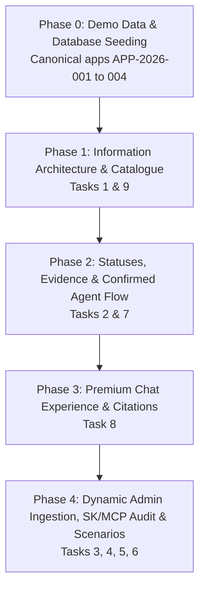

# Phased Implementation Plan & Progress Tracker

> **Core Invariant**: We will NOT break any existing functionality. The passing automated tests, SQL Server EF Core persistence, Identity authentication across the 4 personas, Azure Blob Storage, deterministic domain calculations, and resilience policies remain intact as our solid foundation.
>
> **Execution Strategy**: Strict phase-by-phase delivery with explicit user alignment at each step. No jumping ahead or assuming completion without live verification.

---

## Master Architecture & Task Dependency Mapping

---

## Detailed Phase Status & Tracking

### Phase 0: Foundation, Demo Data & Database Seeding
**Goal**: Create realistic seed data and resolve database model migrations so the local app starts up cleanly without exceptions.
- [x] **Database & Migrations**: Verified EF Core model snapshot is in sync with physical SQL Server schema.
- [x] **Domain State Transitions**: Fixed `LoanApplication.Submit()` lifecycle invariant to allow submission from seeded states.
- [x] **4 Canonical Applications Seeded**:
  - `APP-2026-001` (Alice Cooper): Mortgage, all documents confirmed, ready for review.
  - `APP-2026-002` (Jane Smith): Personal Loan, missing bank statement.
  - `APP-2026-003` (Bob Brown): Mortgage, smudged 72% paystub requiring confirmation.
  - `APP-2026-004` (Charlie Davis): Auto Loan, DTI 54.3% > 45% cap, Ineligible / ReferToHuman.
- [x] **Sample Documents Created**: 6 realistic synthetic files created in `src/Loan.Web/SampleDocuments/`.
- **Status**: 🟢 **100% COMPLETE**

---

### Phase 1: Applicant Information Architecture & Loan Customizer (Tasks 1 & 9)
**Goal**: Fix the jarring landing page where a fresh applicant lands mid-journey in someone else's application.
- [x] **Task 1: Neutral Applicant Landing & Sub-Tabs**
  - [x] Welcome banner ("Welcome, Alice Cooper", Applicant ID, Account).
  - [x] Top sub-tabs: `[ Browse Catalogue & Apply ]` and `[ My Applications ]`.
  - [x] Product Catalogue front-and-center: Product cards for Standard Mortgage (v1.2), Personal Loan (v2.0), and Vehicle Auto Loan (v1.1) with key rates, caps, and effective policy badges.
  - [x] Multi-application switcher and clear journey progress under `[ My Applications ]`.
- [x] **Task 9: "Build Custom Loan" Customizer**
  - [x] Interactive modal allowing applicant to define custom amount, term in months, purpose, and property value.
  - [x] Feeds directly into standard review pipeline without duplicate code.
- **Status**: 🟢 **100% COMPLETE**

---

### Phase 2: Spec Status Alignment, Evidence Blocking & Confirmed Agent Flow (Tasks 2 & 7)
**Goal**: Ensure document extraction reliably blocks unverified progress, and aligns lifecycle statuses with the spec (`PendingInformation` $\rightarrow$ `ReadyForReview` $\rightarrow$ `Approved` $\rightarrow$ `ReturnedForInfo`).
- [x] **Task 7: Spec-Accurate Status Flow**
  - [x] Standardize statuses: `InformationRequested` (Pending Information), `UnderOfficerReview` (Ready for Review), `Approved`, `Rejected`, and `ReturnedForInfo` (`OfficerReturnForInfo`).
  - [x] Display prominent, actionable amber alert banner when status is `InformationRequested` or `ReturnedForInfo` stating exactly what is missing.
  - [x] Verify Officer review queue correctly partitions and handles these statuses (`RequestInformation` action transitions through domain `OfficerDecisionCommand`).
  - *Files*: `src/Loan.Domain/Applications/LoanApplication.cs`, `src/Loan.Web/Views/Applicant/Index.cshtml`, `src/Loan.Web/Controllers/OfficerController.cs`, `src/Loan.Web/Models/ApplicantViewModels.cs`.
- [x] **Task 2: Mandatory Document Gate & Confirmed Fact Set (Enhanced with GPT-4o)**
  - [x] Upload validation checks for required document types per product.
  - [x] Implemented `AzureOpenAiDocumentExtractor` using **GPT-4o** for structured fact extraction with confidence scoring, evidence citations, PII masking, and resilient fallback to `SyntheticDocumentExtractor`.
  - [x] UI reflects all extracted fields in both **Applicant Dashboard** (`Views/Applicant/Index.cshtml`) and **Officer Review** (`Views/Officer/Review.cshtml`) with confidence meters, sensitive field badges, and confirmation buttons.
  - [x] Low-confidence fields ($< 0.85$) hold application in `InformationRequested` until confirmed via modal.
  - [x] `DocumentAnalysisAgent`, `EligibilityAnalysisAgent`, and `ComplianceReviewAgent` strictly consume the single Confirmed Fact Set.
  - [x] Field confirmation dynamically updates `application.Facts` verified state and triggers real-time draft re-evaluation.
- **Status**: 🟢 **100% COMPLETE (Verified across 157 automated tests + Live Azure End-to-End)**

---

### Phase 3: Premium Chat Assistant with ChatGPT-Style Footers (Task 8)
**Goal**: Transform the assistant from a cramped sidebar into a modern, full-featured chat interface across all 4 personas.
- [x] **Task 8: Premium Chat Experience & Citations**
  - [x] Modern, generous layout with user vs assistant message bubbles, live pulsing status dot, animated 3-dot typing shimmer, and smooth token streaming.
  - [x] Quick prompt starter chips for instant one-click policy questioning across Applicant, Officer, and Compliance portals.
  - [x] Numbered in-prose reference markers (`[1]`, `[2]`) highlighted as interactive clickable pill badges (`.copilot-cite-pill`) with auto-scroll and highlight.
  - [x] Dedicated "📚 Grounded Policy Sources" footer strip (`.copilot-sources-strip`) separated visually below each response with clickable chips: `[1] Policy Guide — Section X.X` with excerpt tooltip.
  - [x] Mandatory regulatory non-approval disclaimer displayed in the footer strip on all responses (`.copilot-disclaimer-strip`).
  - [x] Implemented consistently across Applicant (`Applicant/Index.cshtml`), Loan Officer (`Officer/Review.cshtml`), and Compliance Reviewer (`Compliance/Index.cshtml`).
- **Status**: 🟢 **100% COMPLETE (Verified across all test suites + Live endpoints)**

---

### Phase 4: Dynamic Admin Ingestion, SK/MCP Audit & Scenarios (Tasks 3, 4, 5, 6)
**Goal**: Deliver live admin policy document updates without code deployment, verify Semantic Kernel / MCP alignment, and establish testable demonstration scripts for the 4 scenarios.
- [x] **Task 6: Admin Dynamic Policy Ingestion & One-Click Indexing**
  - [x] Added `[ 🔄 Synchronize Authoritative Policies to Azure AI Search ]` one-click action in `/Admin` (`SyncSeedPolicies`) using `text-embedding-3-small` vector embeddings.
  - [x] File upload in `/Admin` allowing administrator to upload a new policy version markdown file and immediately re-index into Azure AI Search.
- [x] **Task 3: SK, MCP & RAG Audit**
  - [x] Added `Microsoft.SemanticKernel` package and registered native Kernel plugins (`IdentityPlugin`, `CreditPlugin`, `PolicySearchPlugin`, `DraftSaverPlugin`).
  - [x] Maintained JSON-RPC MCP Server in `McpToolServer.cs` for external tool calls.
  - [x] Pure deterministic C# domain rules preserved in `Loan.Domain.Eligibility`.
- [ ] **Task 4: Starter Dataset & Realistic Synthetic Documents Verification**
  - [ ] Verify 6 synthetic files and 4 canonical scenarios in live runtime.
- [ ] **Task 5: 12 Synthetic Scenarios & 4 Demonstration Flows**
  - [ ] Verify all 4 required scenarios (Product Advice, Fact Confirmation, Eligibility Recommendation, Prompt Injection Defense) work live on both Happy Path and Failure Path.
- **Status**: 🟡 **Tasks 3 & 6 Completed; Tasks 4 & 5 Ready for Execution (NEXT)**

---

## Current Overall Progress Summary

| Phase | Description | Tasks | Status |
| :--- | :--- | :--- | :--- |
| **Phase 0** | Foundation, Demo Data & DB Migrations | Seeding & EF Core | 🟢 **100% COMPLETE** |
| **Phase 1** | Info Architecture & Loan Customizer | Tasks 1 & 9 | 🟢 **100% COMPLETE** |
| **Phase 2** | Statuses, Evidence & Confirmed Agent Flow | Tasks 2 & 7 | 🟢 **100% COMPLETE** |
| **Phase 3** | Premium Chat Experience & Footers | Task 8 | 🟢 **100% COMPLETE** |
| **Phase 4** | Dynamic Admin Ingestion, SK/MCP & Scenarios | Tasks 3, 4, 5, 6 | 🟡 **IN PROGRESS (Next: Tasks 4 & 5)** |
